# Spis treści

* * *

1. [CEL I ZAKRES PRACY](#cel-i-zakres-pracy)
2. [WSTĘP](#wstep)
3. [WPROWADZENIE DO NORMY STEP](#wprowadzanie-do-normy-step)
    1. [NORMA STEP](#norma-step)
    2. [JĘZYK EXPRESS ORAZ EXPRESS-G](#jezyk-express-oraz-express-g)
    3. [STEP-NC](#step-nc)
    4. [NORMA ISO 14649](#norma-iso-14649)
    5. [NORMA ISO 14649 – CZĘŚĆ 201](#norma-iso-14649-czesc-201)
4. [PROJEKTOWANIE ARCHITEKTURY SYSTEMU APLIKACJI](#projektowanie-architektury-systemu-aplikacji)
    1. [OMÓWIENIE STRUKTURY TYPU KLIENT - SERWER](#omownie-struktury-typu-klient-serwer)
    2. [OMÓWIENIE PROTOKOŁU KOMUNIKACJI POMIĘDZY PRZEGLĄDARKĄ A SERWEREM - POŁĄCZENIE HTTP](#omowienie-protokulu-komunikacji-pomiedzy-przegladarka-a-serwerem-polaczenie-http)
    3. [RODZAJE STRON INTERNETOWYCH](#rodzaje-stron-internetowych)
    4. [KOMUNIKACJA MIĘDZY APLIKACJAMI - API](#komunikacja-miedzy-aplikacjami-api)
    5. [ARCHITEKTURA API - REST](#architektura-api-rest)
    6. [PLANOWANIE API ZGODNIE Z ZASADAMI REST](#planowanie-api-zgodnie-z-zasadami-rest)
    7. [PROJEKTOWANIE API DLA SERWISU INTERNETOWEGO](#projektowanie-api-dla-serwisu-internetowego)
    8. [PROXY](#proxy)
    9. [BAZA DANYCH](#baza-danych)
5. [IMPLEMENTACJA SERWISU INTERNETOWEGO](#implementacja-serwisu-internetowego)
    1. [OMÓWIENIE ŚRODOWISKA NODE.JS ORAZ FRAMEWORK'A EXPRESS.JS](#omowienie-srodowiska-nodejs-oraz-frameworka-expressjs)
    2. [OMÓWIENIE MENEDŻERA PAKIETÓW JS – NPM](#omowienie-menedzera-pakietow-js-npm)
    3. [ZAPROJEKTOWANIE ARCHITEKTURY SERWISU](#zaprojektowanie-architektury-serwisu)
    4. [PLIK KONFIGURACYJNY](#plik-konfiguracyjny)
    5. [MONGOOSE – BIBLIOTEKA DO ZARZĄDZANIE BAZĄ DANYCH M ONGO DB](#mongoose-biblioteka-do-zarzadzanie-baza-danych-mongodb)
    6. [TWORZENIE SERWISÓW](#tworzenie-serwisow) 
    7. [TWORZENIE KONTROLERÓW](#tworzenie-kontrolerow)
    8. [UWIERZYTELNIENIE UŻYTKOWNIKA](#uwierzytelnienie-uzytkownika)
    9. [MODUŁ GŁÓWNY APLIKACJI](#modul-glowny-aplikacji)
    10. [URUCHOMIENIE APLIKACJI](#uruchomienie-aplikacji)
6. [IMPLEMENTACJA APLIKACJI PRZEGLĄDARKOWEJ](#implementacja-aplikacji-przegladarkowej)
    1. [OMÓWIENIE FRAMEWORK'A ANGULAR](#omowienie-frameworka-angular)
    2. [OMÓWIENIE WYKORZYSTANYCH NARZĘDZI FRONT-END'OWYCH](#omowienie-wykorzystanych-narzedzi-front-end-owych)
    3. [KOMUNIKACJA Z SERWEREM](#komunikacja-z-serwerem)
    4. [PROCES UWIERZYTELNIANIA](#proces-uwierzytelniania)
    5. [PROJEKTOWANIE FORMULARZA "MACHINE TOOL SPECIFICATION"](#projektowanie-formularza-machine-tool-specification)
    6. [PROJEKTOWANIE FUNKCJONALNOŚCI DO TWORZENIA FORMULARZY](#projektowanie-funkcjonalnosci-do-tworzenia-formularzy)
    7. [PROJEKTOWANIE PANELU GŁÓWNEGO STRONY](#projektowanie-panelu-glownego-strony)
    8. [UTWORZENIE MODUŁU GŁÓWNEGO](#utworzenie-modułu-glownego)
    9. [PRZYGOTOWANIE APLIKACJI DO URUCHOMIENIA](#przygotowanie-aplikacji-do-uruchomienia)
    10. [OGRANICZENIA](#ograniczenia)
7. KONFIGUROWANIE SERWISU PROXY 
    1. OMÓWIENIE SERWISU N GINX
    2. KONFIGURACJA N GINX 
8. PRZYGOTOWANIE SYSTEMU APLIKACJI DO URUCHOMIENIA 
    1. DOCKER
    2. PLIK KONFIGURACYJNY DO BUDOWANIA OBRAZÓW D OCKER'OWYCH 
    3. AUTOMATYCZNE BUDOWANIE ORAZ UDOSTĘPNIANIE OBRAZÓW 
    4. COMPOSE – ZDEFINIOWANE PLIKU KONFIGURACYJNEGO
    5. ZARZĄDZANIE SERWISAMI 
9. TESTOWANIE APLIKACJI
    1. ZALOGOWANIE SIĘ DO APLIKACJI 
    2. UTWORZENIE NOWEGO FOLDERU GŁÓWNEGO 
    3. UTWORZENIE FORMULARZA "MACHINE TOOL SPECIFICATION"
    4. DODANIE NOWYCH REKORDÓW DO FORMULARZA
    5. GENEROWANIE PLIKU XML 
    6. TWORZENIE WŁASNEGO FORMULARZA 
    7. PODGLĄD ZAWARTOŚCI BAZY DANYCH 
10. STATYSTYKI ORAZ WYKORZYSTANE NARZĘDZIA 
11. PODSUMOWANIE 
12. DYSKUSJA 
13. SUMMARY
14. LITERATURA
15. SPIS ILUSTRACJI
16. SPIS TABEL 
17. ANEKS 

# <a name="cel-i-zakres-pracy"></a> Cel i zakres pracy

* * *

Celem niniejszej pracy dyplomowej jest utworzenie aplikacji internetowej, z możliwością
jej uruchomienia z dowolnej, najnowszej przeglądarki internetowej na komputerze osobistym,
która ma umożliwić użytkownikowi wprowadzenie oraz zapisywanie danych technicznych
obrabiarek zgodnie z normą ISO 14649-201 (opisy obrabiarek objęte tym schematem to frezarki,
centra obróbcze, tokarki i wielozadaniowe maszyny). Aplikacja ma udostępniać również
funkcjonalność do generowania pliku XML na podstawie wprowadzonych danych. Oprócz tego,
aplikacja ma umożliwiać tworzenia własnych, prostych formularzy. Aby aplikacja była łatwa w
obsłudze zostanie również zaimplementowana funkcjonalność do tworzenia katalogów oraz
podkatalogów w celu umożliwienia segregowania formularzy według upodobań użytkownika.
Aplikacja ma być łatwa do instalacji oraz intuicyjna. W tym celu należy wykonać następujące
kroki:
1. Sformułowanie koncepcji budowy systemu aplikacji
2. Wybór sposobu komunikacji pomiędzy poszczególnymi komponentami systemu
3. Wybór odpowiednich technologii oraz narzędzi
4. Implementacja poszczególnych komponentów systemu
5. Uruchomienie systemu aplikacji
6. Testowanie systemu


# <a name="wstep"></a> Wstęp

* * *

Nowoczesne zakłady produkcyjne są budowane na całym świecie, które zawierają sprzęt
oraz oprogramowanie od różnych producentów. Ogromne ilości informacji o produktach muszą
być przesyłane między różnymi urządzeniami i maszynami. Przez to, że każdy system posiada
własne formaty danych, te same informacje muszą być wprowadzane wielokrotnie, prowadząc do
nadmiarowości i błędów [1]. W celu rozwiązania opisanego problemu powstała Międzynarodowa
Organizacja Normalizacyjna (ISO), której celem jest ułatwienie międzynarodowej koordynacji i
unifikacji standardów przemysłowych.

Jedną z norm zdefiniowaną przez ISO jest norma oznaczona numerem 14649-201, będącą
częścią normy STEP oraz STEP-NC. Norma ta definiuje obiektową strukturę danych, która
jednoznacznie charakteryzuje dostępne obrabiarki (frezarki, centra obróbcze, tokarki i
wielozadaniowe maszyny). Dzięki takiemu standardowi dowolny producent obrabiarek może
przekazywać dane do dowolnego systemu CAD/CAM, a producenci systemów CAD/CAM mogą
wymieniać między sobą dane bez konieczności integracji z każdym z dostępnych systemów
osobno.

Niniejsza praca inżynierska ma na celu stworzenie aplikacji, za pomocą której
użytkownik będzie mógł wprowadzić, zapisać a następnie wyeksportować wprowadzone dane
techniczne obrabiarki do formatu XML. Wszystko to zgodnie z normą ISO 14649-201.


# <a name="wprowadzanie-do-normy-step"></a> Wprowadzenie do normy STEP

* * *

## <a name="norma-step"></a> Norma STEP

Nazwa STEP (Standard for the Exchange of Product Model Data) jest to powszechne
określenie normy ISO 10303. STEP zajmuje się danymi o produktach z projektowania
mechanicznego i elektrycznego, wymiarowaniem geometrycznym i tolerancją, analizą i
produkcją, a także dodatkowymi informacjami specyficznymi dla różnych branż, takich jak
motoryzacja, przemysł lotniczy, budownictwo, przemysł stoczniowy, ropa i gaz, przetwarzanie
roślinnych surowców i wiele inne. Zakres ten stale się powiększa, gdyż wydawane są nowe części
normy. Części te są nazywane ISO 10303-xxx, gdzie xxx jest numerem części, a każda jest
standardem samym w sobie, mimo że jest składnikiem większej całości i współzależna od innych
części [2]. Na rys. 3-1 został przedstawiony schemat ideowy normy STEP.


*rys. 3-1 Wymiana danych pomiędzy różnymi systemami [źródło własne]*

Podobnie jak inne normy ISO, STEP jest chroniony prawami autorskimi ISO i nie jest
swobodnie dostępny. Jednak schematy 10303 EXPRESS są udostępniane bezpłatnie, podobnie jak
zalecane praktyki dla wdrażających normę [3]


## <a name="jezyk-express-oraz-express-g"></a> Język EXPRESS oraz EXPRESS-G

EXPRESS to bogaty i dojrzały język służący do definiowania obiektowych schematów
danych. Jest on częścią standardu STEP (ISO 10303) i jest szeroko stosowany w modelowaniu
danych dla zastosowań przemysłowych na dużą skalę, w tym do produkcji, inżynierii, platform
wiertniczych, zakładów przetwórczych itp. Jest wykorzystywany wszędzie tam, gdzie
projektowanie jest wspomagane komputerowo (systemy CAD). Jest on używany do opisania i
konfiguracji trójwymiarowej geometrii części stałych oraz i zespołów tych części w różnego 
rodzaju maszynach, począwszy od samochodów, po samoloty, skończywszy na platformach
wiertniczych, statkach i elektrowniach. Jego celem jest uwolnienie danych CAD od zależności
zastrzeżonych systemów komputerowych i formatów, a tym samym umożliwienie wymiany
danych opisujących wytwarzane produkty między systemami podczas projektowania procesu
produkcyjnego [4].

Użyteczność tego języka sprawiła, że musiał sprostać wyzwaniom wykraczającym poza
pierwotne przewidywania. Oprócz kształtu i konfiguracji produktu, jego wymagań projektowych
oraz instrukcji obsługi, należało również opisać historię obsługi i użytkowania w firmie. W
przypadku dużego lub kosztownego produktu informacje o cyklu życia mogą być co najmniej tak
samo ważne jak opis jego fizycznej konfiguracji. Informacje mogą być potrzebne w czasie
rzeczywistym pomiędzy wieloma użytkownikami w środowisku sieciowym, a nie tylko
wymieniane okresowo, co było pierwotną intencją STEP.

EXPRESS jest językiem leksykalnym o charakterze obiektowym, jest podobny do
języków programowania takich jak Pascal, czy C. Na rys. 3-2 został przedstawiony przykładowy
zapis schematu „Family” w języku EXPRESS.

```
SCHEMA Family;

ENTITY Human
    ABSTRACT SUPERTYPE OF (ONEOF (Man, Woman));
    name: STRING;
    mother: OPTIONAL Woman;
    father: OPTIONAL Man;
END_ENTITY;

ENTITY Man
    SUBTYPE OF (Human);
END_ENTITY;

ENTITY Woman
    SUBTYPE of (Human);
END_ENTITY;

END_SCHEMA;
```
*rys. 3-2 Model schematu "Family" zapisany w języku EXPRESS*

Schemat „Family” zawiera encję („ENTITY”) o nazwie „Human”. Encja ta została
oznaczona jako abstrakcyjna („ASBSTRACT”). Powoduje to, że nie może być tworzona
samodzielnie, ale może być podtypem innej encji. W tym schemacie encja „Human” jest podtypem
encji „Woman” oraz „Man”. Każda encja „Human” lub jej podtyp zawiera pole: „name” oraz
opcjonalnie „mother” oraz „father”, które wskazują na inny obiekt („Man” lub „Woman”).

Instrukcja obsługi języka EXPRESS w ISO 10303-11 definiuje także graficzny
podzestaw języka leksykalnego o nazwie EXPRESS-G. Jest to standardowa notacja graficzna dla
modeli informacyjnych. Uważa się go powszechnie za przydatny dodatek do języka EXPRESS,
który służy do wyświetlania definicji encji i typów, relacji i liczności. Ta notacja graficzna
obsługuje podzbiór języka EXPRESS. Jedną z zalet używania EXPRESS-G nad EXPRESS jest
to, że struktura modelu danych może być przedstawiona w bardziej zrozumiały sposób, a wadą,
że nie można formalnie określić ograniczeń złożonych [5].

rys. 3-3 przedstawia schemat danych zapisany za pomocą języka EXPRESS-G. Definicje
typów danych i schematów na diagramie są oznaczone ramkami, które zawierają nazwę
definiowanego elementu. Relacje między elementami są oznaczone liniami łączącymi te pola.
Odmienne style linii dostarczają informacji na temat rodzaju definicji lub relacji.


*rys. 3-3 Model "Family" zapisany za pomocą języka EXPRESS-G wraz z objaśnieniem poszczególnych relacji [ISO 10303-11]*


## <a name="step-nc"></a> STEP-NC

STEP-NC jest językiem sterowania obrabiarek, który rozszerza normę ISO 10303 o
modele obróbki, które są zawarte w ISO 14649. Dodaje również wymiary geometryczne i dane
tolerancji oraz model STEP PDM do integracji z większymi przedsiębiorstwami. Wynik tych
działań został znormalizowany i zapisany jako ISO 10303-238 (znany również jako AP238) [6].

Obrabiarki ewoluowały od prostych maszyn z kontrolerami, które nie posiadały pamięci,
napędzane przez perforowaną taśmę do dzisiejszych, wysoce automatyzowanych systemów
sterowanych numerycznie, znanych jako obrabiarki CNC. Możliwości obrabiarek zmieniły się
radykalnie, ale język programowania zasadniczo pozostał taki sam. Wprowadzanie danych do
systemu CNC za pomocą G-code’ów (opisanych przez normę ISO 6983, również znaną pod nazwą RS-274)
jest często specyficzne dla maszyny i ograniczone do poleceń ruchu osi. Przez to
obrabiarka nie posiada żadnych użytecznych informacji o produkcie, takich jak dane o wymiarach
geometrycznych półfabrykatu, tolerancjach, właściwościach materiału, ustawieniu urządzenia i
innych informacjach wytworzonych podczas projektowania i planowania technologii produkcji .
Wszystkie te informacje znikną podczas konwersji ścieżki narzędzia w G-Code, przez co przepływ
informacji staje się jednokierunkowy [7]. Uproszczony schemat przepływu danych został
przedstawiony na rys. 3-4.


*rys. 3-4 Sposób programowania obrabiarek CNC za pomocą G-code'ów [źródło własne]*

STEP-NC został zaprojektowany w celu zastąpienia kodów G nowoczesnym protokołem
komunikacyjnym, który łączy dane procesowe sterowane komputerowo (CNC) z opisem produktu
obrabianej części. Program STEP-NC może wykorzystywać pełny zakres konstrukcji
geometrycznych ze standardu STEP do przekazywania ścieżek narzędzi niezależnych od
urządzenia CNC. Dostarcza również opis operacyjny CAM i geometrię STEP CAD do obrabiarki
CNC, dzięki czemu przedmioty obrabiane, uchwyty i kształty narzędzi skrawających mogą być
wizualizowane i analizowane w kontekście ścieżek narzędziowych. Dzięki takiej wizualizacji
możliwe jest pokazanie ścieżki narzędzia w kontekście maszyny i przedmiotu obrabianego,
symulacji na maszynie, w celu sprawdzenia, czy nie występują zakłócenia i inne niepożądane
zachowania, a dzięki wspólnemu protokołowi wymiany danych możliwe jest wysłanie informacji
zwrotnej z produkcji do projektu [8]. Uproszczony schemat przepływu danych pomiędzy
systemem CAD/CAM a obrabiarką CNC został przedstawiony na rys. 3-5.


*rys. 3-5 Sposób programowania obrabiarek CNC z wykorzystaniem STEP-NC [źródło własne]*


## <a name="norma-iso-14649"></a> Norma ISO 14649

ISO 14649 to model transferu danych pomiędzy systemami CAD/CAM i maszynami
CNC, który zastępuje normę ISO 6983 poprzez usunięcie wad precyzując procesy obróbki
wykorzystując koncepcję obiektową. CNC jest odpowiedzialny za tłumaczenie kroków roboczych
na ruch osi i pracę narzędzia. Główną zaletą ISO 14649 jest wykorzystanie istniejących modeli
danych z ISO 10303. Jako że ISO 14649 zapewnia kompleksowy model procesu produkcyjnego,
może być również wykorzystany jako podstawa dwu- i wielokierunkowej wymiany danych
między innymi systemami informatycznymi [9].

ISO 14649 reprezentuje zorientowane obiektowo, informacyjno-kontekstowe podejście
do programowania sterowanego numerycznego (NC), które zastępuje redukcję danych do prostych
instrukcji przełączania lub ruchów liniowych i kołowych. Ponieważ jest zorientowany na obiekty
i funkcje oraz opisuje operacje obróbki wykonywane na obrabianym przedmiocie, a nie ruchy osi
zależne od maszyny, będzie on działał na różnych obrabiarkach lub sterownikach [9].

Formularz informacji w ISO 14649 pozwala na znaczne ulepszenia w stosunku do
istniejących metod, ale w celu wsparcia jeszcze bardziej wydajnej produkcji, oprócz informacji o
produkcji potrzebny jest opis środowiska produkcyjnego. W związku z tym, ta część ISO 14649
jest pierwszym krokiem umożliwiającym opis obrabiarek jako zasobów produkcyjnych. Opis
umożliwia projektantom procesów klasyfikowanie ich potrzeb maszynowych w ramach planu
mikro procesowego (plik ISO 14649), określanego jako model wymagań. Model umożliwia także
opisanie istniejących obrabiarek jako zasobów do produkcji, określanych jako modele katalogowe
[9].

Ta część normy ISO 14649 ma na celu zapewnienie podstaw do planowania i symulacji
procesów, na przykład dla twórców kontrolerów i programistów obrabiarek do opisywania ich
produktów, a także do badań. Norma ta określa również elementy danych opisu maszyn
specyficzne dla obrabiarek, potrzebne jako dane procesowe dla produkcji i charakterystyk maszyn.
Opisy obrabiarek objęte tym schematem to frezarki, centra obróbcze, tokarki i wielozadaniowe
maszyny. Ta część ISO 14649 nie ma na celu zastąpienia istniejących standardów opisu
obrabiarek, ale obejmuje konkretne potrzeby opisu zasobów produkcyjnych dla potrzeb
produkcyjnych w technologiach opisanych w ISO 14649.


## <a name="norma-iso-14649-czesc-201"></a> Norma ISO 14649 – część 201

Część 201 normy ISO 14649 jest odpowiedzialna za określenie danych technicznych
obrabiarek wykorzystywanych w procesach skrawania. Norma ta składa się z:
* opisu modelów poszczególnych encji składających się na daną normę
* przedstawionych zależności poszczególnych encji w języku EXPRESS
* przedstawionych zależności poszczególnych encji w języku EXPRESS-G
* przykładów danych technicznych obrabiarek i danych dotyczących wymagań
* obrabiarek dla różnych zastosowań

Rdzeniem całego modelu owej normy jest encja „machine_tool”, która składa się z pola
„description” typu „text”. Jednostki takie jak „machine_tool_requirements” oraz
„machine_tool_specification” dziedziczą po jednostce „machine_tool”. Opisany powyżej
fragment normy został przedstawiony w sposób graficzny na rys. 3-6 za pomocą języka
EXPRESS-G, który obrazuje występujące relacje.


*rys. 3-6 Fragment normy ISO 14649-201 przedstawiający rdzeń schematu „machine_tool” za pomocą języka EXPRESS-G [10]*

Cała norma składa się z pięćdziesięciu dziewięciu encji połączonych między sobą
odpowiednimi relacjami oraz z siedemnastu zdefiniowanych typów, z czego dwanaście jest typem
wyliczeniowym. Każda encja jest dokładnie opisana: zawiera zastosowanie danej encji wraz z
objaśnieniem każdego z pól. Na rys. 3-7 został przedstawiony fragment normy ISO 14649-201
objaśniający encję „machine_tool_specification” za pomocą języka EXPRESS wraz z opisem
poszczególnych pól.

Fragment normy ISO 14649-201 przedstawiający encję „machine_tool_specification” w języku EXPRESS wraz z opisem poszczególnych pól [10]


*rys. 3-7 Fragment normy ISO 14649-201 przedstawiający encję „machine_tool_specification” w języku EXPRESS wraz z opisem poszczególnych pól [10]*

Zgodnie z wymaganiami postawionymi aplikacji, nie wszystkie encje zostały
zaimplementowane. Wynika to z tego, że niektóre dane są bardzo specyficzne i przeznaczone dla
bardzo wąskiej grupy przypadków. W tab. 3-1 zostały przedstawione, wraz z opisem, wszystkie
encje, które zostały zaimplementowane w napisanej aplikacji.

*tab. 3-1 Spis encji, które zostały zaimplementowane w napisanej aplikacji [10]*

| Nazwa encji                	| Opis encji                                                                                                                                                                                                                                                                                                                                                  	|
|----------------------------	|-------------------------------------------------------------------------------------------------------------------------------------------------------------------------------------------------------------------------------------------------------------------------------------------------------------------------------------------------------------	|
| machine_tool_specification 	| Ta encja opisuje właściwości obrabiarki, która jest urządzeniem z różnymi ruchomymi częściami, które wykonują pracę.                                                                                                                                                                                                                                        	|
| device_id                  	| Ta encja opisuje informacje identyfikacyjne urządzenia.                                                                                                                                                                                                                                                                                                     	|
| locator                    	| Ta jednostka opisuje lokalizację i informacje o własności maszyny w firmie. Dokładna zawartość lokalizatora zależy od firmy.                                                                                                                                                                                                                                	|
| installation               	| Ta jednostka opisuje informacje o instalacji i planowaniu obiektu.                                                                                                                                                                                                                                                                                          	|
| machine_size               	| Ta encja opisuje ogólne wymiary maszyny                                                                                                                                                                                                                                                                                                                     	|
| electrical                 	| Ta jednostka opisuje właściwości dostarczonej energii elektrycznej.                                                                                                                                                                                                                                                                                         	|
| hydraulics                 	| Ta jednostka opisuje właściwości układu hydraulicznego.                                                                                                                                                                                                                                                                                                     	|
| environmental_evaluation   	| Ta jednostka służy do oceny wpływu narzędzia obrabianego na środowisko zgodnie ze standardowym procesem obróbki. Zasadniczo ta jednostka opisuje wpływ maszyny na środowisko i powiązaną z nią eksploatację jako zużytą energię i emisje.                                                                                                                   	|
| standard_machining_process 	| Ta jednostka służy do opisania standardowego procesu obróbki obrabiarki i oceny użytej mocy oraz emisji tego procesu.                                                                                                                                                                                                                                       	|
| machining_capability       	| Ta encja opisuje możliwości obróbki obrabiarki.                                                                                                                                                                                                                                                                                                             	|
| machining_size             	| Ta jednostka opisuje rozmiar obrabianego przedmiotu, który można obrabiać za pomocą obrabiarki w odniesieniu do kierunków osi obrabiarki.                                                                                                                                                                                                                   	|
| measuring_capability       	| Ta encja opisuje zdolność pomiarową obrabiarki.                                                                                                                                                                                                                                                                                                             	|
| machine_tool_element       	| Podmiot ten opisuje właściwości elementów obrabiarek, z których składa się obrabiarka.                                                                                                                                                                                                                                                                      	|
| element_capability         	| Ta encja opisuje typy możliwości elementu maszynowego.                                                                                                                                                                                                                                                                                                      	|
| machine_tool_axis          	| Ta encja opisuje właściwości osi maszyny.                                                                                                                                                                                                                                                                                                                   	|
| linear_axis                	| Ta encja opisuje właściwości osi liniowej.                                                                                                                                                                                                                                                                                                                  	|
| rotary_axis                	| Ta encja opisuje właściwości osi obrotowej.                                                                                                                                                                                                                                                                                                                 	|
| continuous_rotary          	| Ta jednostka opisuje właściwości ciągłej osi obrotowej.                                                                                                                                                                                                                                                                                                     	|
| indexing                   	| Ta encja opisuje właściwości indeksującej osi obrotowej.                                                                                                                                                                                                                                                                                                    	|
| limited_swing              	| Ta jednostka opisuje właściwości ograniczonej wahadłowej osi obrotu.                                                                                                                                                                                                                                                                                        	|
| work_table                 	| Ta encja opisuje właściwości tabeli utrzymywania pracy.                                                                                                                                                                                                                                                                                                     	|
| circular_work_table        	| Ta encja opisuje właściwości okrągłego stołu maszyny.                                                                                                                                                                                                                                                                                                       	|
| rectangular_work_table     	| Ta encja opisuje właściwości prostokątnego stołu roboczego.                                                                                                                                                                                                                                                                                                 	|
| pallet                     	| Ta encja opisuje właściwości palety.                                                                                                                                                                                                                                                                                                                        	|
| t_slot                     	| Ta encja opisuje właściwości rowków T na stole roboczym lub palecie.                                                                                                                                                                                                                                                                                        	|
| spindle                    	| Ta encja opisuje właściwości wrzeciona. Wrzeciono jest osią obracającą się z narzędziem lub detalem. Ta jednostka jest nadrzędnym wrzecionem narzędziowym i wrzecionem roboczym. Wszystkie jednostki wrzeciona pochodzą z tego nadtypu. Specyfikacja wrzeciona jest określona przez jego właściwości fizyczne, w tym prędkość, długość lub średnicę gwintu. 	|
| tool_spindle               	| Ta encja opisuje właściwości wrzeciona narzędziowego. Wrzeciono narzędziowe to wrzeciono do obracania narzędzia tnącego. Wrzeciono stożkowe, wrzeciono proste i wrzeciono gwintowane pochodzą z tego elementu. Te podtypy są określone przez kształt wrzeciona.                                                                                             	|
| tapered_spindle            	| Ta encja opisuje właściwości zwężającego się wrzeciona.                                                                                                                                                                                                                                                                                                     	|
| straight_spindle           	| Ta encja opisuje właściwości prostego wrzeciona.                                                                                                                                                                                                                                                                                                            	|
| threaded_spindle           	| Ta encja opisuje właściwości gwintowanego wrzeciona.                                                                                                                                                                                                                                                                                                        	|
| work_spindle               	| Ta encja opisuje właściwości wrzeciona roboczego. Wrzeciono robocze jest wrzecionem, które służy do obracania przedmiotu obrabianego.                                                                                                                                                                                                                       	|
| spindle_range              	| Ta jednostka opisuje dolny i górny limit zakresu wrzeciona. Składa się z prędkości obrotowej i momentu obrotowego wrzeciona.                                                                                                                                                                                                                                	|
| turret                     	| Ta encja opisuje właściwości wieży.                                                                                                                                                                                                                                                                                                                         	|
| tool_assembly              	| Ta jednostka opisuje właściwości zestawu narzędzi, który zawiera narzędzie tnące i jego uchwyty narzędziowe.                                                                                                                                                                                                                                                	|
| tool_changer               	| Ta encja opisuje właściwości zmieniacza narzędzi, które nie zawierają magazynu narzędzi.                                                                                                                                                                                                                                                                    	|
| tool_magazine              	| Ta encja opisuje właściwości magazynu magazynu narzędzi.                                                                                                                                                                                                                                                                                                    	|
| Coolant                    	| Ta encja opisuje właściwości układu chłodzenia procesowego.                                                                                                                                                                                                                                                                                                 	|
| sensor                     	| Ta encja opisuje właściwości dodatkowego urządzenia wykrywającego.                                                                                                                                                                                                                                                                                          	|
| tool_setting               	| Ta encja opisuje właściwości stacji nastawiania narzędzi.                                                                                                                                                                                                                                                                                                   	|
| tool_breakage              	| Ta encja opisuje właściwości czujnika złamania narzędzia.                                                                                                                                                                                                                                                                                                   	|
| part_probe                 	| Ta encja opisuje właściwości sondy części.                                                                                                                                                                                                                                                                                                                  	|
| Chuck                      	| Ta jednostka opisuje właściwości uchwytu.                                                                                                                                                                                                                                                                                                                   	|
| Collet                     	| Ta encja opisuje właściwości tulei.                                                                                                                                                                                                                                                                                                                         	|
| bar_feeder                 	| Ta encja opisuje właściwości podajnika prętów.                                                                                                                                                                                                                                                                                                              	|
| Tailstock                  	| Ta jednostka opisuje właściwości konika.                                                                                                                                                                                                                                                                                                                    	|


# <a name="projektowanie-architektury-systemu-aplikacji"></a> Projektowanie architektury systemu aplikacji

* * *

Przed przystąpieniem do pisania aplikacji należy najpierw zaplanować architekturę
całego systemu, który zostanie utworzony. W związku tym, że aplikacja ma zostać utworzona dla
„sieci”, muszą zostać zaprojektowane co najmniej dwa komponenty: aplikacja kliencka, która
będzie wykorzystywana przez przeglądarkę oraz aplikacja działającej po stronie serwera (aplikacja
serwerowa [11]), która będzie obsługiwać żądania wysyłane przez klienta (przeglądarkę). Jest to
klasyczny przykład architektury typu klient-serwer [12]. Obecnie zaprojektowany system został
przedstawiony na rys. 4-1.


*rys. 4-1 Schemat zaprojektowanego systemu składającego się z dwóch komponentów: klienta (przeglądarki) oraz serwisu internetowego [źródło własne]*

Aplikacja ma za zadanie zapisywać dane dostarczone przez użytkownika (przeglądarkę),
dlatego w tym celu będzie potrzebny system do zarządzania danymi (baza danych). Baza danych
to system, który służy do przechowywania informacji oraz umożliwia sprawne manipulowanie
nimi, dzięki czemu zarządzanie dużą ilością danych jest względnie łatwe oraz efektywne [13]. W
Internecie jest dostępnych mnóstwo darmowych systemów bazodanowych, które umożliwiają
wydajne manipulowanie danymi, w związku z tym nie ma potrzeby pisania własnej implementacji
[14]. W związku z powyższym, do zaprojektowanego wcześniej systemu zostanie dołączony
serwer bazodanowy. Aktualny schemat systemu został przedstawiony na rys. 4-2.


*rys. 4-2 Schemat zaprojektowanego systemu składającego się z trzech komponentów: klienta (przeglądarki), serwisu internetowego oraz serwisu bazy danych [źródło własne]*

Projektowana aplikacja ma oferować klientowi (osobie korzystającej z oprogramowania)
bogatą paletę operacji oraz wysoką dynamikę. Aby sprostać tym wymaganiom strona internetowa
powinna być „aplikacją”, a więc idealnie sprawdzą się w tym przypadku aplikacje jednostronicowe - SPA. Dobrze napisana strona typu SPA nie wymaga udziału serwera do generowania podstron,
dlatego wystarczy tylko zwykły serwer plików, którego zadaniem będzie przechowywanie danych
niezbędnych do uruchomienia aplikacji przez klienta (przeglądarkę) z możliwością ich pobrania.
W związku z powyższym do zaprojektowanego systemu zostanie dołączony serwis
przechowywujący pliki źródłowe aplikacji klienckiej. Aktualnie zaprojektowany system został
przedstawiony na rys. 4-3.


*rys. 4-3 Zaprojektowany system składający się z czterech komponentów: klienta (przeglądarki), serwisu internetowego, serwisu bazy danych oraz serwisu przechowywującego pliki źródłowe aplikacji klienckiej [źródło własne]*

Klient (przeglądarka), aby móc korzystać z systemu aplikacji, musi mieć dostęp do dwóch
komponentów: serwisu z plikami źródłowymi (w celu pobrania i uruchomienia aplikacji przez
przeglądarkę) oraz serwisu z logiką biznesową (serwis internetowy). W takim wypadku, system
musi udostępniać na „zewnątrz” dwa porty. Dlatego, że na danym komputerze, na jednym porcie,
może być uruchomiona tylko jedna aplikacja jednocześnie, nie ma możliwości udostępnienia
całego systemu pod jednym IP lub jedną domeną na jednym porcie. Stanowi to problem w
szczególności w sieciach firmowych, w których administratorzy sieci bardzo często blokują porty,
które nie są ustandaryzowane, przez co klient może mieć problem z nawiązaniem połączenia z
aplikacjami. Jeżeli serwis z logiką biznesową zostanie uruchomiony na standardowym porcie, np.:
porcie 80 (przeznaczonym dla połączeń http), to serwis z plikami źródłowymi aplikacji klienckiej
musi zostać uruchomiony na innym porcie, który może być blokowany przez administratora sieci,
w której aplikacja jest uruchomiona. W celu poradzenia sobie z tym problemem należy
wykorzystać serwer proxy. Zadaniem serwera proxy będzie przekierowywanie żądań na
odpowiednie aplikacje w zależności od dostarczonego URL’a. Dzięki takiemu zabiegowi jest
możliwość skomunikowania się z odpowiednim serwerem bez bezpośredniej interakcji z nim, a 
co za tym idzie ominięcie blokady portów. W związku z powyższym do zaprojektowanego
wcześniej systemu zostanie dołączony serwis proxy. Ostateczna faza zaprojektowanego systemu
została przedstawiona na rys. 4-4.


*rys. 4-4 Zaprojektowany system składający się z pięciu aplikacji: klienta (przeglądarki), serwisu internetowego, serwisu bazy danych, serwisu przechowywującego pliki źródłowe aplikacji klienckiej oraz serwisu proxy [źródło własne]*


## <a name="omownie-struktury-typu-klient-serwer"></a> Omówienie struktury typu klient-serwer

Model klient-serwer jest to wzór architektury oprogramowania, który dzieli zadania
między dostawców zasobów i usług, zwanych serwerami oraz wyzwalaczami usług, nazywanymi
klientami. Często klienci i serwery komunikują się za pośrednictwem sieci komputerowej na
oddzielnym sprzęcie, ale zarówno klient, jak i serwer mogą znajdować się w tym samym systemie.
Host serwera uruchamia jeden lub więcej programów serwera, które udostępniają swoje zasoby
klientom. Klient nie udostępnia żadnych zasobów, ale żąda funkcji lub usługi serwera . Klienci
inicjują zatem sesje komunikacyjne z serwerami oczekującymi na przychodzące żądania [12].

Architektura klient-serwer stała się jednym z podstawowych modeli obliczeniowych w
sieci. Wiele typów aplikacji zostało napisanych przy użyciu modelu klient-serwer. Standardowe
funkcje sieciowe, takie jak wymiana poczty e-mail, dostęp do sieci i dostęp do bazy danych, są
oparte na modelu klient-serwer. Na przykład przeglądarka internetowa to program klienta na
komputerze użytkownika, który może uzyskać dostęp do informacji na dowolnym serwerze
WWW na świecie. Na rys. 4-5 został przedstawiony schemat sieci komputerowej, w której klienci
komunikują się z serwerem za pośrednictwem Internetu.


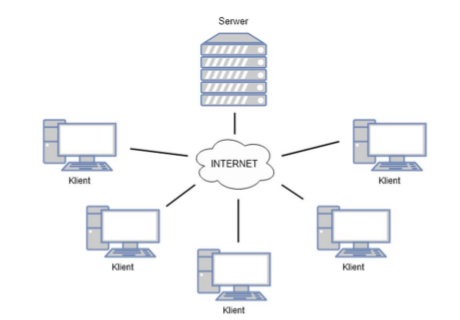
*rys. 4-5 Schemat sieci komputerowej klientów komunikujących się z serwerem za pośrednictwem Internetu w architekturze klient-serwer [źródło własne]*

## <a name="omowienie-protokulu-komunikacji-pomiedzy-przegladarka-a-serwerem-polaczenie-http"></a> Omówienie protokołu komunikacji pomiędzy przeglądarką a serwerem - połączenie HTTP

Żądanie-odpowiedź to wzorzec wymiany komunikatów, w którym jeden komputer
wysyła komunikat żądania do systemu, który odbiera i przetwarza żądanie, ostatecznie zwracając
wiadomość. Jest to prosty, ale potężny wzorzec przesyłania wiadomości, który pozwala dwóm 
aplikacjom prowadzić dwukierunkową rozmowę ze sobą przez kanał komunikacyjny. Ten
wzorzec jest szczególnie powszechny w architekturach klient-serwer.

Dla przykładu, kiedy klient banku uzyskuje dostęp do usług bankowości internetowej za
pomocą przeglądarki internetowej, jako klient inicjuje żądanie na serwer internetowy banku. Dane
logowania klienta są przechowywane w bazie danych, więc serwer sieciowy uzyskuje dostęp do
serwera bazy danych jako klient. Serwer aplikacji interpretuje zwrócone dane z bazy danych
poprzez zastosowanie logiki biznesowej, po czym wreszcie serwer WWW zwraca wynik do
przeglądarki klienta, w celu wyświetlenia danych. Na każdym etapie tej sekwencji wymiany
komunikatów pomiędzy klientem a serwer komputer przetwarza żądanie i zwraca dane. Przepływ
danych w wyżej podanym przykładzie został zobrazowany na rys. 4-6.

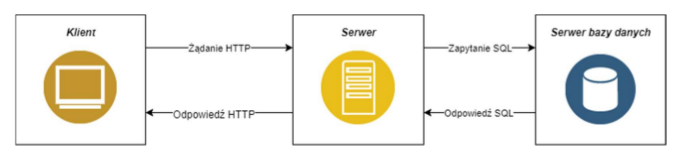
*rys. 4-6 Schemat komunikacji typu żądanie-odpowiedź pomiędzy klientem, serwerem oraz bazą danych [źródło własne]*

Dla uproszczenia wzorzec ten jest zwykle implementowany w sposób całkowicie
synchroniczny, tak samo dzieje się w przypadku wywołań usług internetowych za pośrednictwem
protokołu HTTP, który utrzymuje połączenie otwarte i czeka, aż odpowiedź zostanie dostarczona
lub zawiesza działanie, gdy upłynie limit maksymalnego czasu oczekiwania na odpowiedź. Jednak
komunikacja typu żądanie-odpowiedź może być również zaimplementowana asynchronicznie, a
odpowiedź jest zwracana w nieznanym czasie.

## <a name="rodzaje-stron-internetowych"></a> Rodzaje stron internetowych

Strona internetowa jest do dokument, który został utworzony dla „sieci”, najczęściej o
rozszerzeniu HTML. Oznacza to, że owy dokument może zostać „otworzony” za pomocą
przeglądarki internetowej, której zadaniem jest odpowiednie wyświetlenie jego zawartości,
zgodnie ze zdefiniowanymi przez programistę regułami, zawartymi w dokumencie. Dokument ten
jest najczęściej przechowywany na komputerze podłączonym do Internetu (serwerze), z którym
łączą się przeglądarki internetowe (najczęściej poprzez protokół http) w celu jego pobrania a
następnie wyświetlenia jego zawartości. Proces ten został przedstawiony na rys. 4-7

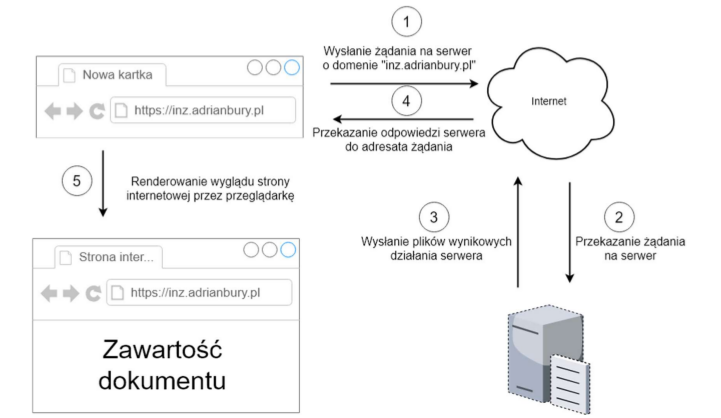
*rys. 4-7 Proces komunikacji z serwerem przez przeglądarkę internetową [źródło własne]*

Po wpisaniu nazwy domeny, w przeglądarce internetowej, przeglądarka wysyła żądanie
do serwera na którym znajdują się pliki witryny. Przeglądarka pobiera te pliki, zwykle dokumenty
HTML, i towarzyszące im obrazy lub filmy, po czym wyświetla je na ekranie. HTML i inne języki
(CSS, JavaScript) używane do wyświetlania danych przez przeglądarkę internetową są zwykle
określane jako technologie Front-End’owe [15].

### <a name="tradycyjna-strona-internetowa"></a> Tradycyjna strona internetowa – MPA

„Multiple Page Application” (MPA) jest to termin, który odnosi się do stron
internetowych tworzonych w sposób „tradycyjny” [16]. Każde żądanie, wyświetlenie nowych
danych lub wysłanie danych na serwer w celu ich przetworzenia lub zapisania, wiąże się z potrzebą
wygenerowania a następnie wyświetlenia całej strony od nowa, co wiąże się z względnie długim
czasem oczekiwania. Proces ten został przedstawiony na rys. 4-8.


*rys. 4-8 Proces wyświetlania kolejnych podstrony witryny internetowej [źródło własne]*

Ze względu na to, że logika generowania dokumentów HTML jest umiejscowiona na
serwerze, serwer ten oprócz docelowej logiki musi również mieć zaimplementowane
funkcjonalności umożliwiające generowanie dokumentów HTML, co wiąże się z zużyciem
dodatkowych zasobów serwera. Uproszczony proces przetwarzania żądania przez serwer w tego
typu stronach internetowych został przedstawiony na rys. 4-9.

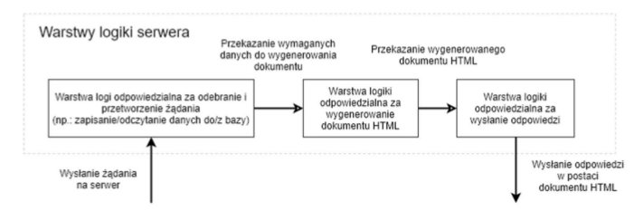
*rys. 4-9 Uproszczony schemat przetwarzania żądania przez serwer w stronach internetowych typu MPA [źródło własne]*

### <a name="aplikacja-internetowa-spa"></a> Aplikacja internetowa - SPA

Termin „Single Page Application” (SPA) jest zwykle używany do opisywania aplikacji,
które zostały zbudowane dla „sieci”. Aplikacje te są dostępne za pośrednictwem przeglądarki
internetowej, podobnie jak „tradycyjne” witryny internetowe, ale oferują bardziej dynamiczne
interakcje przypominające natywne aplikacje mobilne i stacjonarne. Najbardziej zauważalną
różnicą między witryną tradycyjną, a SPA jest zmniejszona ilość pełnych przeładowań strony.
SPA mają większe wykorzystanie zapytań AJAX (Asynchronous JavaScript And XML), czyli
sposobu na komunikację z serwerem bez konieczności pełnego odświeżania strony w celu
pobrania danych oraz aktualizacji widoku w aplikacji [17]. rys. 4-10 przedstawia uproszczony
schemat komunikacji pomiędzy przeglądarką a serwerem, gdy dostarczona strona internetowa jest
aplikacją internetową.


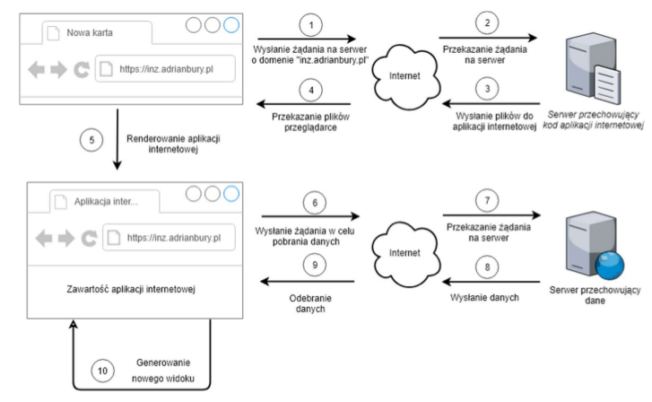
*rys. 4-10 Sposób komunikacji pomiędzy SPA a serwerem [źródło własne]*

Po pobraniu całej przesłanej aplikacji internetowej i uruchomieniu jej przez przeglądarkę
(kroki 1-5), aplikacja wysyła żądanie na serwer w celu pobrania odpowiednich danych. Gdy dane
zostaną już dostarczone, aplikacja wygeneruje odpowiednie podstrony (kroki 6-10). Jeżeli dane
ulegną zmianie, nie ma potrzeby pobierania całej aplikacji od nowa (tak jak ma to miejsce w
MPA), wystarczy, że zostanie ponownie zainicjowane żądanie pobrania danych z serwera (kroki
6-10).

Ze względu na to, że cała logika generowania podstron witryny została przeniesiona na
aplikację (przeglądarkę), nie ma potrzeby implementowania warstwy logiki odpowiedzialnej za
generowanie dokumentów HTML na serwerze. W związku z tym proces przetwarzania żądania
przez serwer przechowywujący dane zostanie znacznie uproszczony (rys. 4-11).

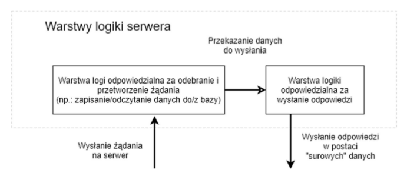
*rys. 4-11 Uproszczony schemat przetwarzania żądania przez serwer bez warstwy logiki odpowiedzialnej za generowanie dokumentów HTML [źródło własne]*

Budowanie stron internetowych typu SPA stało się w ostatnim czasie bardzo popularne i
obecnie jest uważane za nowoczesną praktykę rozwojową. Jednak każde rozwiązanie posiada
wady, które zawsze należy uwzględnić podczas podejmowania decyzji na budowanie aplikacji
tego typu. Z powodu, że przeglądarka wykonuje większość operacji, takich jak na przykład
dynamiczne generowanie widoków, powoduje to, że w urządzeniach o małej mocy obliczeniowej,
wydajność takich aplikacji może stanowić poważny problem. Dodatkowo, takie strony są bardzo
ciężkie do analizy przez boty internetowe, przez co wyszukiwarki internetowe mogą niewłaściwie
interpretować treści znajdujące się na stronie [17].

Aplikacje typu SPA powinny być przede wszystkim wykorzystywane podczas tworzenia
zaawansowanych aplikacji, w których ważniejsze jest zapewnienie dużej ilości funkcji i logiki niż
statycznych stron z dużą ilością tekstu. Stąd SPA doskonale sprawdzą się w sytuacjach takich jak
aplikacje bankowe, panele administracyjne, zaawansowane kalkulatory i aplikacje przetwarzające
rozbudowane formularze HTML. Natomiast totalnie nie sprawdzą się na blogach, serwisach
informacyjnych i innych stronach z dużą ilością tekstu i artykułów [18].

Im więcej interaktywności ma miejsce po stronie klienta, tym więcej kodu JavaScript jest
potrzebne, aby te interaktywne elementy obsłużyć. Im więcej kodu jest napisane, tym ważniejsze
jest posiadanie czystej i dobrze zaprojektowanej bazy kodu, przez co programiści nieustanie
pracują nad tworzeniem i ulepszaniem narzędzi, dzięki którym tworzenie SPA staje się szybsze i
przyjemniejsze [17]. Istnieje wiele szkieletów aplikacji JavaScript o otwartym kodzie źródłowym,
które pomagają w budowaniu tego typu aplikacji, jakich jak np.: Angular, React, Vue.js, Backbone
[19].

## <a name="komunikacja-miedzy-aplikacjami-api"></a> Komunikacja między aplikacjami - API

Aby się komunikować, komputery muszą korzystać ze wspólnego języka i przestrzegać
reguł, aby zarówno klient, jak i serwer wiedzieli, czego się spodziewać. Język i zasady
komunikacji są zdefiniowane w protokole komunikacyjnym. Wszystkie protokoły klient-serwer
działają w warstwie aplikacji. Protokół warstwy aplikacji określa podstawowe wzorce dialogu.
Aby jeszcze bardziej sformalizować wymianę danych, serwer może zaimplementować interfejs
aplikacji (API). API jest warstwą abstrakcji do uzyskiwania dostępu do usługi. Ograniczając
komunikację do określonego formatu zawartości, ułatwia to przetwarzanie.

W programowaniu komputerowym, API (Application Programming Interface) jest
zbiorem podprogramów, definicji, protokołów i narzędzi do tworzenia oprogramowania. Jest to
zbiór jasno określonych metod komunikacji między różnymi komponentami oprogramowania.
Dobre API ułatwia tworzenie programów komputerowych poprzez dostarczanie wszystkich
elementów składowych, które następnie są zestawiane przez programistę. API może zostać
napisane dla systemu internetowego, systemu operacyjnego, systemu baz danych, sprzętu
komputerowego lub bibliotek oprogramowania. Na przykład jeśli firma programistyczna
zamierza utworzyć edytor tekstu działający w systemie Microsoft Windows, twórcy tego edytora
tekstu wykorzystają różne funkcje wbudowane w system Windows, zamiast próbować napisać te
funkcje od nowa. W tym kontekście Microsoft zapewnił API jako środek dostępu do usługi
okienkowania w systemie operacyjnym Windows, a twórcy tysięcy aplikacji działających w tym
systemie „skonsumowali” tę usługę za pośrednictwem interfejsu API. Deweloperzy nie musieli
pisać kodu, aby narysować pasek tytułu okna, ani nie musieli pisać funkcji do zmiany rozmiaru
okna, zamiast tego, funkcje te zostały odziedziczone przez każde okno utworzone za pomocą
interfejsu API znajdującego się w samym systemie Microsoft Windows [20].

API nie są ograniczone jedynie do systemu Windows, ani też nie są ograniczone do
systemu, który jest obecnie używany na urządzeniu. API, na przykład, może zostać stworzone na
serwerach www, które umożliwi dostęp do konkretnych informacji z witryny.

## <a name="architektura-api-rest"></a> Architektura API - REST

REST jest to akronim od słów REpresentational State Transfer. REST to styl
architektoniczny zapewniający standardy między systemami komputerowymi w sieci, w celu
ułatwienia systemom komunikowanie się między sobą [21]. Aby daną architekturę można było
nazwać architekturą REST’ową musi ona spełniać pięć następujących ograniczeń [22]:

* Architektura jest typu klient-serwer

W architekturze REST zawsze jest klient i serwer, gdzie komunikacja jest zawsze
inicjowana przez klienta. Klient i serwer są oddzielone od siebie jednolitym interfejsem, dzięki
czemu zarówno klient, jak i serwer rozwijają się niezależnie.

* System jest bezstanowy

Każde żądanie od dowolnego klienta zawiera wszystkie informacje niezbędne do obsługi
żądania, a stan sesji jest przechowywany w kliencie. Stan sesji może być przeniesiony przez serwer
do innej usługi, takiej jak baza danych, w celu utrzymania trwałego stanu przez pewien okres i
umożliwienia uwierzytelnienia. Klient rozpoczyna wysyłanie żądań, gdy jest gotowy do przejścia
do nowego stanu.

* Wykorzystywanie pamięci podręcznej

Klienci i pośrednicy mogą buforować odpowiedzi, odpowiedzi zatem muszą, pośrednio
lub bezpośrednio, określać się jako buforowane lub nie, aby uniemożliwić klientom ponowne
wykorzystanie nieaktualnych lub niewłaściwych danych w odpowiedzi na kolejne żądania. Dobrze
zarządzane buforowanie częściowo lub całkowicie eliminuje niektóre interakcje klient-serwer,
dodatkowo poprawiając skalowalność i wydajność.

* System jest systemem warstwowym

System warstwowy jest systemem, w którym komponenty są grupowane (warstwowane)
w układzie hierarchicznym tak, że niższe warstwy zapewniają funkcje i usługi, które obsługują
wyższe warstwy. Systemy o coraz większej złożoności i możliwościach można rozbudować,
dodając lub zmieniając warstwy, aby poprawić ogólne możliwości systemu.

* Jednolity interfejs

Interfejs jest jednolity dla wszystkich aplikacji. Oznacza to, że informacje przesyłane są
w ustandaryzowanej formie, a nie w zależności od potrzeb konkretnej aplikacji. Interfejs REST
został opracowany z myślą o wydajnym transferze danych o dużej ziarnistości, optymalizując go
pod kątem wspólnego przypadku w sieci, w wyniku czego interfejs nie jest optymalny dla innych
form interakcji architektonicznych.

## <a name="planowanie-api-zgodnie-z-zasadami-rest"></a> Planowanie API zgodnie z zasadami REST

API serwisu internetowego jest to interfejs, który składa się z co najmniej z jednego
„punktu końcowego” (URI), który jest ukierunkowany na system wiadomości typu żądanie-
odpowiedź. Dane zwykle są wyrażone w formacie JSON lub XML, który jest przesyłany za
pośrednictwem Internetu, najczęściej za pomocą HTTP (REST API może zostać również
zaimplementowane dla innych protokołów) [23].

Punkty końcowe są ważnymi aspektami interakcji z internetowymi API po stronie
serwera, ponieważ określają, gdzie znajdują się zasoby dostępne dla oprogramowania stron
trzecich (klientów). Dostęp odbywa się za pośrednictwem identyfikatora URI, do którego są
wysyłane żądania HTTP i od którego oczekuje się odpowiedzi. Punkty końcowe muszą być
statyczne, w przeciwnym razie nie można zagwarantować prawidłowego działania
oprogramowania, które z nimi współdziała. Jeśli lokalizacja zasobu ulegnie zmianie (a wraz z nim
punkt końcowy), wówczas uprzednio napisane oprogramowanie przestanie działać poprawnie,
ponieważ wymagany zasób nie będzie już dostępny pod danym identyfikatorem. tab. 4-1 pokazuje
najczęściej projektowane API z wykorzystaniem metody http zgodne z architekturą REST.

*tab. 4-1 Przykład najczęściej projektowanego API dla HTTP zgodnego z zasadami REST*

| Akcja                                   	| Metoda HTTP 	| URI                      	|
|-----------------------------------------	|-------------	|--------------------------	|
| Pobranie całej kolekcji                 	| GET         	| /kolekcja/               	|
| Pobranie pojedynczego elementu kolekcji 	| GET         	| /kolekcja/identyfikator/ 	|
| Utworzenie nowego elementu kolekcji     	| POST        	| /kolekcja/               	|
| Podmiana elementu kolekcji              	| PUT         	| /kolekcja/identyfikator/ 	|
| Edycja elementu kolekcji                	| PATCH       	| /kolekcja/identyfikator/ 	|
| Usunięcie elementu kolekcji             	| DELETE      	| /kolekcja/identyfikator/ 	|

## <a name="projektowanie-api-dla-serwisu-internetowego"></a> Projektowanie API dla serwisu internetowego

W zaprojektowanym systemie (opisanym powyżej) będzie następowała komunikacja
pomiędzy aplikacją kliencką oraz serwerem. W związku z tym należy zaprojektować sposób
komunikacji pomiędzy tymi aplikacjami. W tym celu zostało zaprojektowanego API, które
zostanie zaimplementowane przez serwis internetowy. Zaprojektowanie API zostało
przedstawione w tab. 4-2. Jako format danych został wybrany format JSON ze względu na jego
bardzo dużą popularność oraz łatwość implementacji.

*tab. 4-2 Tabela przedstawia zaprojektowane API dla serwisu internetowego*

| Żądanie 	| URI                                 	| Ładunek                                            	| Odpowiedź                                       	|
|---------	|-------------------------------------	|----------------------------------------------------	|-------------------------------------------------	|
| GET     	| /folders/                           	| -                                                  	| Drzewiasta  struktura folderów                  	|
| POST    	| /folders/                           	| Dane potrzebne do utworzenia folderu               	| Utworzony folder                                	|
| PUT     	| /folders/{folderId}/                	| Dane potrzebne do zaktualizowania podanego folderu 	| Zaktualizowany folder                           	|
| DELETE  	| /folders/{folderId}/                	| -                                                  	| Usunięty folder                                 	|
| GET     	| /forms/                             	| Kryteria formularza (opcjonalnie)                  	| Wszystkie formularze spełniające dane kryterium 	|
| POST    	| /forms/                             	| Dane potrzebne do utworzenia formularza            	| Utworzony formularz                             	|
| GET     	| /forms/{formId}/                    	| -                                                  	| Wybrany formularz                               	|
| GET     	| /forms/{formId}/inputs/             	| -                                                  	| Pobranie pól danego formularza                  	|
| GET     	| /forms/{formId}/records/            	| -                                                  	| Pobranie rekordów danego formularza             	|
| GET     	| /forms/{formId}/records/{recordId}/ 	| -                                                  	| Pobranie podanego rekordu z formularza          	|
| POST    	| /forms/{formId}/records/            	| Dane potrzebne do utworzenia rekordu               	| Utworzony rekord                                	|
| PUT     	| /forms/{formId}/records/{recordId}/ 	| Dane potrzebne do zaktualizowania podanego rekordu 	| Zaktualizowany rekord danego formularza         	|
| DELETE  	| /forms/{formId}/records/{recordId}/ 	| -                                                  	| Usunięcie danego rekordu                        	|

## <a name="proxy"></a> Proxy

W sieciach komputerowych, serwer proxy jest to serwer pośredniczący, który działa jako
pośrednik pomiędzy różnymi serwerami, przekazując żądania. Klient łączy się z serwerem proxy,
żądając usługi, takiej jak na przykład pobranie pliku, strony internetowej, wykonanie jakieś
operacji lub jakikolwiek inny zasób dostępny z innego serwera. Następnie serwer proxy pyta
serwer docelowy o zasób, po czym zwraca odpowiedź z powrotem do klienta [24].

Wyróżnia się dwa główne podziały serwera proxy ze względu na sposób przekazywania
zasobów: proxy otwarte oraz odwrócone (z ang. „reverse”). Proxy otwarte jest to proxy, do którego
każdy klient połączony z siecią ma dostęp do owego serwera, za pomocą którego może łączyć się
z dowolnym innym serwerem [24]. Na rys. 4-12 został przedstawiony graficzny zapis sposobu
działania otwartego serwera proxy.

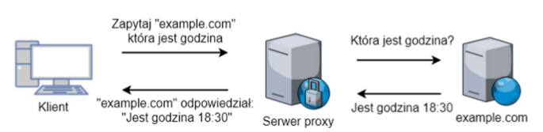
*rys. 4-12 Zasada działania otwartego serwera proxy [źródło własne]*

Natomiast odwrotny serwer proxy to serwer, który wydaje się klientom, że jest
„zwykłym” serwerem, ponieważ odpowiedź z serwera proxy jest zwracana tak, jakby pochodziła
bezpośrednio z oryginalnego serwera, pozostawiając klienta bez znajomości serwerów
źródłowych [24]. Na rys. 4-13 został graficznie przedstawiony sposób działania przykładowego
odwróconego serwera proxy.

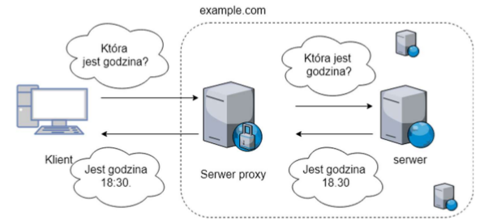
rys. 4-13 Przykład działania odwróconego serwera proxy [źródło własne]

## <a name="baza-danych"></a> Baza danych

Baza danych to abstrakcja systemu plików systemu operacyjnego, która ułatwia
programistom tworzenie aplikacji, które tworzą, odczytują, aktualizują i usuwają trwałe dane.
Bazy danych sprawiają, że zorganizowana pamięć masowa jest niezawodna i szybka [25]. Dwa
najpopularniejsze rodzaje baz danych to bazy relacyjne (SQL) oraz nierelacyjne (NoSQL) [26].

W relacyjnych bazach danych wszystkie dane są przechowywane w relacjach (tabelach),
a każda relacja składa się z wierszy i kolumn. Ważną cechą modelu relacyjnego jest wykorzystanie
kluczy. Są to specjalnie wyznaczone kolumny w relacji, służące do porządkowania danych lub
powiązania danych z innymi relacjami. Jednym z najważniejszych kluczy jest klucz podstawowy,
który służy do jednoznacznej identyfikacji każdego wiersza danych. Klucz obcy jest unikalną
referencją odnoszącą się do danych w jednej relacji z kluczem podstawowym innej relacji [27].

Relacyjne bazy danych wymagają zdefiniowania schematów przed dodaniem danych.
Oznacza to, że w celu przechowania danych, baza danych SQL musi z góry wiedzieć, co będzie
przechowywać. Jeśli baza danych jest duża, jest to bardzo powolny proces, który wymaga
znacznych przestojów. Jeśli często następuje zmiana danych, które przechowuje aplikacja, przestój
ten może być niewskazany. Nie ma również możliwości, za pomocą relacyjnej bazy danych,
efektywnego adresowania danych, które są całkowicie nieuporządkowane lub z góry nieznane.
Oprócz zdefiniowania struktury danych, model relacyjny ustanawia także zestaw zasad
wymuszających integralność danych, znanych jako ograniczenia integralności. Określa również
sposób manipulowania danymi. Ponadto model definiuje specjalną cechę zwaną normalizacją w
celu zapewnienia wydajnego przechowywania danych [27].

Bazy danych NoSQL zostały zbudowane w celu umożliwienia wstawiania danych bez
wstępnie zdefiniowanego schematu. Ułatwia to wprowadzanie istotnych zmian w aplikacji w
czasie rzeczywistym, bez martwienia się o przerwy w świadczeniu usług - co oznacza, że
tworzenie jest szybsze, integracja kodu jest bardziej niezawodna i potrzeba mniej czasu
administratora bazy danych. Programiści zwykle muszą dodać kod po stronie aplikacji, aby
wymusić kontrolę jakości danych, na przykład nakazując obecność określonych pól, typów danych
lub dopuszczalnych wartości. Bardziej wyrafinowane bazy danych NoSQL umożliwiają
stosowanie zasad sprawdzania poprawności w bazie danych, co pozwala użytkownikom
wymuszać zarządzanie danymi, przy jednoczesnym zachowaniu korzyści płynących ze stosowania
dynamicznego schematu [28].

W tab. 4-3 zostały wyszczególnione główne różnice pomiędzy opisywanymi bazami danych.

*tab. 4-3 Porównanie relacyjnych baz danych z bazami nierelacyjnymi [29]*
// ToDO: Add table

W niniejszej pracy do zapisywania danych została wykorzystana nierelacyjna baza
danych – MongoDB. Baza ta idealnie sprawdzi się w zaprojektowanej aplikacji ze względu na
możliwość zapisu danych w formacie BSON oraz jej dynamiczny schemat. Dzięki temu, że
MongoDB jest popularne wśród programistów, istnieje mnóstwo bibliotek o otwartym kodzie
źródłowym, które znacząco ułatwią wykonywania operacji na niniejszej bazie.

# <a name="implementacja-serwisu-internetowego"></a> Implementacja serwisu internetowego

## <a name="omowienie-srodowiska-nodejs-oraz-frameworka-expressjs"></a> Omówienie środowiska Node.js oraz framework’a Express.js

Node.js jest to „open-source”, „cross-platform” JavaScript’owe środowisko służące do
wykonywania kodu JavaScript po stronie serwera. Z historycznego punktu widzenia JavaScript
był używany głównie do obsługi skryptów po stronie klienta (przeglądarki) na stronach
internetowych, przetwarzanych przez silnik JavaScript’owy w przeglądarce użytkownika.
Natomiast Node.js umożliwił uruchamiania plików JavaScript po stronie serwera. W związku z
tym Node.js stał się jednym z podstawowych elementów paradygmatu „JavaScript wszędzie”,
umożliwiając tworzenie aplikacji internetowych korzystając tylko z jednego języka
programowania, zamiast polegać na różnych językach do pisania skryptów po stronie serwera i
klienta [30].

Chociaż „.js” jest to konwencjonalne rozszerzenie pliku dla kodu JavaScript, nazwa
„Node.js” nie odnosi się do konkretnego pliku w tym kontekście i jest jedynie nazwą produktu.
Node.js ma architekturę sterowaną zdarzeniami, zdolną do asynchronicznych operacji
wejść/wyjść. Te wybory projektowe mają na celu optymalizację przepustowości i skalowalności
w aplikacjach internetowych z wieloma operacjami wejścia/wyjścia, a także w aplikacjach
internetowych działających w czasie rzeczywistym (np. programy komunikacyjne w czasie
rzeczywistym i gry przeglądarkowe) [31].

Natomiast Express.js to minimalny i bardzo elastyczny framework, napisany w Node.js
do łatwiejszego tworzenia aplikacji internetowych. Narzędzie to, dzięki zapewnieniu bogatej ilości
zestawu gotowych funkcji znaczenie przyśpiesza tworzenie złożonych operacji biznesowych.
Przykład minimalistycznej aplikacji napisanej z wykorzystaniem Express.js został przedstawiony
na rys. 5-1.

```
// import biblioteki
const express = require(‘express’);
// utworzenie nowej instancji aplikacji express
const app = express();
// zdefiniowanie adresu
app.get(‘/’, (req, res) => res.send(‘Hello World!’));
// uruchomienie serwera na porcie 3000
app.listen(3000, () =>
      console.log(‘Example app listening on port 3000!’));
```
*rys. 5-1 Przykład prostej aplikacji napisanej z wykorzystaniem Express.js*

Aby uruchomić napisany kod, należy go zapisać do pliku „app.js” (nazwa ta jest tylko
przykładowa) i zainstalować wymagane biblioteki, wpisując w wierszu poleceń odpowiednie
komendy, tak jak pokazano na rys. 5-2. W celu sprawdzenia czy aplikacji działa poprawnie należy
przejść na stronę http://localhost:3000/.

```
# zainstalowanie globalnie biblioteki express
$ npm install -g express
# uruchomienie aplikacji
$ node app.js
```
*rys. 5-2 Komendy do instalacji oraz uruchomienia aplikacji napisanej w Express.js*

## <a name="omowienie-menedzera-pakietow-js-npm"></a> Omówienie menedżera pakietów JS – NPM

NPM to menedżer pakietów dla języka JavaScript. Jest to domyślny menedżer dla
środowiska wykonawczego Node.js. Oznacza to, że po pobraniu oraz zainstalowaniu Node.js
automatycznie instaluje się również npm [32].

Najlepszym sposobem na zarządzanie zainstalowanymi lokalnie pakietami npm jest
utworzenie pliku „package.json”. Plik ten, o z góry zdefiniowanej strukturze, zawiera listę
pakietów, których wymaga projekt wraz z odpowiednią wersją. Takie działanie sprawia, że
instalacja wymaganych pakietów jest całkowicie automatyczna oraz odtwarzalna. Na rys. 5-3
została przedstawiona zawartość pliku „package.json” z listą wymaganych bibliotek oraz
dostępnych skryptów dla aplikacji backend’owej, napisanej na potrzeby owej pracy.

```
{
    "name": "inz-core",
    "version": "2.0.0",
    "scripts": {
        "start": "npm run start-dev",
        "start-prod": "NODE_CONFIG_ENV=production && node src/bin/www.js",
        "start-dev":"NODE_CONFIG_ENV=development && nodemon -x src/bin/www.js"
    },
    "dependencies": {
        "body-parser": "~1.18.2",
        "boom": "^7.2.0",
        "config": "^1.30.0",
        # (...) pozostałe bibloteki
    },
        "devDependencies": {
        "nodemon": "^1.14.12"
    }
}
```
*rys. 5-3 Zawartość pliku „package.json” dla aplikacji back-end’owej*

Menedżer npm może automatycznie zarządzać plikiem „package.json” poprzez
odpowiednie komendy. Najważniejsze z nich zostały przedstawiony na rys. 5-4.

```
$ cd /sciezka/do/projektu

# automatyczne generowanie pliku „package.json”
# z domyślnie skonfigurowaną treścią
$ npm init -y

# komenda instalująca bibliotekę
# argument „—save” oznacza, że biblioteka zostanie
# dopisana do pliku „package.json” w polu „dependencies”
$ npm install nazwa_biblioteki—save

# instalacja pakietów zdefiniowanych w „package.json”
$ npm install

# komenda do uruchamienia skryptów zdefiniowanych w „package.json”
# w miejsce „nazwa_skryptu” należy podać nazwę skryptu
# zdefiniowane skrypty: start, start-dev, start-prod
$ npm run nazwa_skryptu
```
*rys. 5-4 Lista podstawowych komend dostępnych w npm*

## <a name="zaprojektowanie-architektury-serwisu"></a> Zaprojektowanie architektury serwisu

Aplikacja umożliwia użytkownikom końcowym komunikację z serwisem po HTTP.
Dodatkowo aplikacja, do zapisu danych, korzysta z bazy danych. W związku z powyższym
aplikacja została podzielona na trzy logiczne warstwy:
* Kontrolery - zadaniem kontrolera jest odczytanie wiadomości wysłanej przez HTTP oraz uruchomienie odpowiedniej logiki biznesowej dostępnej w serwisie
* Serwisy – serwis dostarcza zestaw funkcjonalności, które realizują logikę biznesową np.: zapisanie lub pobranie odpowiednich danych z bazy
* Modele – model ma za zadanie zapewnić komunikację pomiędzy aplikacją a bazą danych z możliwością wykonywania operacji bazodanowych, w tym również walidację modelu

Opisane warstwy zostały, w sposób graficzny, przedstawione na rys. 5-5.

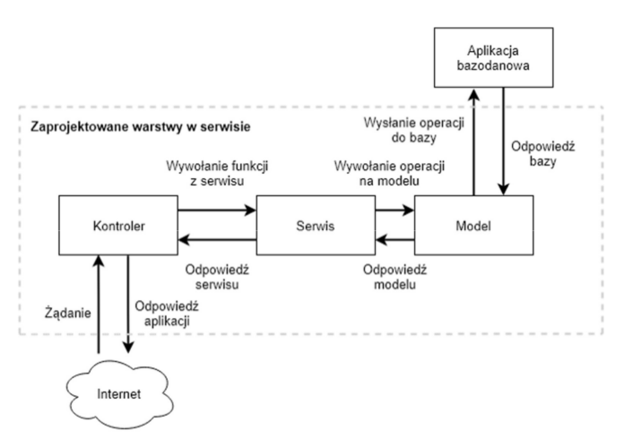
*rys. 5-5 Zaprojektowane warstwy w serwisie internetowym [źródło własne]*

# <a name="plik-konfiguracyjny"></a> Plik konfiguracyjny

Plik konfiguracyjny służy do zdefiniowana parametrów działania niektórych funkcji w
aplikacji, takie ja na przykład: dane do łączenia się z bazą danych lub dane uwierzytelniające. Do
obsługi plików konfiguracyjnych została wykorzystana biblioteka „node-config”. W pracy zostały
zdefiniowane dwa pliki konfiguracyjnego: dla wersji deweloperskiej oraz produkcyjnej.
Zawartość pliku konfiguracyjnego dla wersji produkcyjnej została przedstawiona na rys. 5-6.

```
// wartość zmiennych jest pobierana ze zmiennych środowiskowych
// poprzez pobranie wartości obiektu
// process.env[‘nazwa_zmiennej_srodowiskowej’]
module.exports = {
    auth: {
        user:     process.env['AUTH_USER'],
        password: process.env['AUTH_PASSWORD']
    },
    database: {
        host: process.env['DB_HOST'],
        name: process.env['DB_NAME']
    },
    logger: {
        level: 'info'
    }
};
```
*rys. 5-6 Zawartość pliku konfiguracyjnego dla wersji produkcyjnej*

## <a name="mongoose-biblioteka-do-zarzadzanie-baza-danych-mongodb"></a>Mongoose – biblioteka do zarządzanie bazą danych MongoDB

Mongoose jest to biblioteka, która oferuje proste, oparte na schemacie rozwiązanie do
modelowania danych aplikacji w Node.js z możliwością zapisania danych w bazie MongoDB.
Obejmuje ona wbudowane modelowanie, sprawdzanie poprawności, ułatwia tworzenie zapytań
bazodanowych a także rozszerza logikę biznesową [33].

### <a name="laczenie-z-baza-mongo-db"></a> Łączenie z bazą MongoDB

Przez rozpoczęciem pracy z MongoDB należy najpierw nawiązać połączenie z bazą
danych. W tym celu należy zaimportować moduł „mongoose”, a następnie wywołać funkcję
„connect” z podaniem odpowiednich parametrów. Ze względu na to, że połączenie to może się nie
powieść, dobrą praktyką jest wyświetlenie stosownego powiadomienia. Do wyświetlania
powiadomień został wykorzystany moduł „log4js”. Kod napisany w utworzonej aplikacji,
wykonujący wymienione czynności, został przedstawiony na rys. 5-7.

```
// import bibliotek
const log4js = require('log4js');
const logger = log4js.getLogger();
const mongoose = require('mongoose');
const config = require('config');

const uri = `mongodb://${config.database.host}/${config.database.name}`;

// utworzenie funkcji do łączenia się z bazą
function connectToDB() {
    mongoose
        .connect(uri)
        .then( _ => logger.info("Connected to the database"))
        .catch( _ => {
            logger.error("Error while connecting to the database");
            logger.info("Trying to reconnect");
            // spróbuj ponownie się połączyć z bazą po 5 sekundach
            setTimeout(connectToDB, 5000);
        });
}

// wywołanie funkcji
connectToDB();

// export modułu
module.exports = mongoose;
```
*rys. 5-7 Kod służący do łączenia się z bazą MongoDB*

Należy pamiętać, że wszystkie operacje bazodanowe muszą być wykonywane dopiero po
uzyskaniu połączenia z bazą, w przeciwnym wypadku napisana aplikacja nie będzie działać
poprawnie.

### <a name="definiowanie-i-tworzenie-modeli"></a> Definiowanie i tworzenie modeli

W mongoose wszystkie operacje bazodanowe są dostarczane za pomocą modeli. Model
jest to z zdefiniowany schemat, który na podstawie podanych parametrów jest odpowiedzialny za
zarządzanie odpowiednią kolekcją bazy danych. W związku z tym przed rozpoczęciem pracy na
danych, należy utworzyć model z odpowiednimi właściwościami.

W niniejszej pracy zostały utworzone dwa modele. Model o nazwie „Folder”,
odpowiedzialny za przechowywanie struktury folderów oraz model „Form”, który magazynuje
dane potrzebne do definiowania, generowania oraz dodawania kolejnych wartości formularzy.

#### <a name="omowienie-modelu-folder"></a> Omówienie modelu "Folder"

Model „Folder”, odpowiedzialny za przechowywanie informacji o folderach, składa się
z jednego pola, pola „name”. W polu „name” jest przechowywana nazwa folderu. Oprócz tego
potrzebna jest jeszcze informacja o strukturze folderów. Ta funkcjonalność jest dostarczana przez
wtyczkę o nazwie „mongoose-path-tree”, napisana przez społeczność, o otwartym kodzie
źródłowym. Na rys. 5-8 została przedstawiona definicja modelu „Folder” wraz z użyciem
wymienionej wtyczki.

```
// Import potrzebnych bibliotek
const mongoose = require('mongoose');
const Schema = mongoose.Schema;
const tree = require('mongoose-path-tree');

// Zdefiniowanie schematu
const FolderSchema = new Schema({
    name: {
        type: String,
        required: true
    }
});

// Podpiętcie wtyczki “tree”
FolderSchema.plugin(tree);

// Utworzenie modelu o nazwie “Folder”
const Folder = mongoose.model('Folder', FolderSchema);

// eksport modelu
module.exports = Folder;
```
*rys. 5-8 Zdefiniowanie modelu o nazwie "Folder”*

Podpięta wtyczka „mongoose-path-tree” rozszerza dany schemat o pole „parent”, które
zawiera identyfikator folderu, w którym znajduje się folder oraz pole „path”, dostarczające
informacji o ścieżce danego folderu. Przykładowe wykorzystanie wtyczki zostało przedstawione
na rys. 5-9.

```
// Utworzenie folderów
const obrabiarki = new Folder({ name: "Obrabiarki" });
const skrawajace = new Folder({ name: "Skrawające" });

// Zdefiniowanie hierarchii
skrawajace.parent = obrabiarki;

//Zapisanie do bazy danych
obrabiarki.save().then( _ => {
    skrawajace.save();
});
```
*rys. 5-9 Przykład wykorzystania wtyczki ”mongoose-path-tree” do zapisu struktury folderów*

Po uruchomieniu i wykonaniu programu przedstawionego na rys. 5-9 zostaną zapisane w
bazie dokumenty o treści przedstawionej na rys. 5-10.

```
// dokument nr 1
{
    "_id" : "50136e40c78c4b9403000001",
    "name" : "Obrabiarki",
    "path" : "50136e40c78c4b9403000001"
}
// dokument nr 2
{
    "_id"sdf : "50136e40c78c4b9403000002",
    "name" : "Skrawające",
    "parent" : "50136e40c78c4b9403000001",
    "path": "50136e40c78c4b9403000001#50136e40c78c4b9403000002"
}
```
rys. 5-10 Podgląd danych zapisanych w bazie danych po wykonaniu programu

W celu odtworzenia struktury folderów należy skorzystać z funkcji „getChildrenTree”,
która została dostarczona razem z dołączoną wcześniej wtyczką. Przykładowy kod obrazujący
działanie funkcji został przedstawiony na rys. 5-11. Podanie jako argumentu wartości „null”
oznacza, że zostanie odtworzona struktura dla wszystkich folderów. Jeżeli zostanie podany
identyfikator folderu, zostanie odtworzona struktura dla podanego folderu oraz jego pod folderów.

```
// Odtworzenie struktury dla wszystkich folderów
Folder.getChildrenTree( null, {}, function (err, tree) {
    console.log(tree);
});

// Wynik, jaki wyświetli się w konsoli po uruchomieniu programu
[
    {
        _id: "50136e40c78c4b9403000001",
        name: "Obrabiarki",
        path: "50136e40c78c4b9403000001",
        parent: "",
        children: [
            {
                _id: "50136e40c78c4b9403000002",
                name: "Skrawające",
                parent: "50136e40c78c4b9403000001",
                path: "50136e40c78c4b9403000001#50136e40c78c4b9403000002",
                children: [ ]
            }
        ]
    }
];
```
*rys. 5-11 Przykładowe zastosowanie funkcji „getChildrenTree”*

#### <a name="omowienie-modelu-form"></a> Omówienie modelu "Form"

Model „Form” służy do przechowywania informacji na temat formularzy przypisanych
do konkretnych folderów. Składa się z pięciu pól: „name”, „folder”, „inputs”, „records” oraz
„predefined”. W polu „name” przechowywana jest nazwa formularza, pole „inputs” odpowiedzialne 
jest za przechowywania informacji o zdefiniowanych polach edycyjnych, takich 
jak etykieta, typ oraz wartości. W polu „folder” przechowywany jest identyfikator folderu, do
którego należy dany formularz. W tablicy „records” przechowywane są wszystkie dane zapisane
przy pomocy formularzy. Ze względu na to, że istnieje możliwość zapisu danych z formularzy,
które nie zostały utworzone przy pomocy generatora, zostało dodatkowo dodane pole o nazwie
„predefinded”, za pomocą którego aplikacja klienta jest wstanie rozpoznać, czy formularz ma
zostać stworzony na podstawie pól „inputs”, czy ma zostać załadowany z aplikacji klienta. Na rys.
5-12 został przedstawiony utworzony model w aplikacji.

```
// Import wymaganych bibliotek
const mongoose = require("mongoose");
const Schema = mongoose.Schema;

//Zdefiniowanie schematu
const formSchema = new Schema({
    name: { type: String, required: true },
    folder: { type: Schema.Types.ObjectId, ref: "Folder" },
    inputs: [{
        name: {
            type: String,
            required: true
        },
        label: {
            type: String,
            required: true
        },
        type: {
            type: String,
            required: true
        }
    }],
    records: [{
        values: {
            type: Schema.Types.Mixed,
            required: true
    }
    }],
    predefined: { type: Boolean, default: false }
});

// Utworzenie modelu oraz jego eksport
const Form = mongoose.model("Form", formSchema);
module.exports = Form;
```
*rys. 5-12 Zdefiniowanie modelu o nazwie "Form"*

### <a name="wykonywanie-operacji-bazodanowych"></a> Wykonywanie operacji bazodanowych

W celu wykonywania operacji na kolekcjach, takich jak operacje dodawania, usuwania
lub aktualizowania danych zapisanych w bazie, biblioteka mongoose dostarcza zestaw metod
statycznych, dostępnych dla stworzonych modelów. Na rys. 5-13 zostały przedstawione wybrane
operacje przeszukiwania bazy, jakie zostały wykorzystane w aplikacji.

```
// Import zdefiniowanego modelu
const FormModel = require('./form.model');

// Przeszukanie bazy w celu znalezienia formularza o podanym identyfikatorze
FormModel
    .findById("50136e40c78c4b9403000001")
    .then( form => console.log(form) );

// Przeszukanie bazy w celu znalezienia wszystkich formularzy o podanych parametrach
FormModel
    .find({ folder: "50136e40c78c4b97je401"})
    .then( forms => console.log(forms) );

// Przeszukanie bazy w celu otrzymania formularzy, które zawierają rekord o podanym „_id”
FormModel
    .find( { "records._id": "50136e40c78c4b9403000325" } )
    .then( forms => console.log(forms) );
```
*rys. 5-13 Spis operacji służących do pobierania danych z bazy*

W celu dodania dokumentów lub ich aktualizacji należy posłużyć się funkcjami, które
zostały przedstawione na rys. 5-14

```
// Import zdefiniowanego modelu
const FormModel = require('./form.model');

// Zapisanie modelu do bazy danych
const formData = {
    name:    "Example name",
    inputs:  [{ name: "lenght", label: "Długość", type: "number"],
    records: [],
    folder:  "50136e40c78c4b9403450325",
}
const form = new FormModel( formData );
form.save().then( savedModel => consol.log( savedModel ) );

// Dodanie rekordu do formularza
const formId = "50136e40c78c4b940348a325";
const record = { "length": 154 };
FormModel.findByIdAndUpdate(
    formId,
    {$push: {records: record}},
    {new: true}
).then( updatedForm => console.log(updatedForm) );

// Usunięcie redordu z formularza
const recordIdToRemove = "50136e40c78c4b940348a725";
FormModel.update(
        { },
        {$pull: {"records": {_id: recordIdToRemove } } },
        {new : true}
    ).then( updatedForm => console.log(updatedForm) );

// Usunięcie dokumentu z podanym identyfikatorem
FormMode
    .findByIdAndRemove("50136e40c78c4b940348r725")
    .then( removalStatistics => console.log(removalStatistics) );
```
*rys. 5-14 Spis operacji służących do dodawania, aktualizowania oraz usuwania danych z bazy*

## <a name="tworzenie-serwisow"></a> Tworzenie serwisów

Serwis jest to warstwa w aplikacji odpowiedzialna za wykonywanie logiki biznesowej,
takiej jak na przykład: pobranie, dodanie czy aktualizowanie danych z bazy danych. W aplikacji
utworzonej na potrzeby niniejszej pracy zostały utworzone dwa serwisy: serwis obsługujący
zarządzanie folderami oraz drugi, odpowiedzialny za formularze. Fragment utworzonego serwisu
dla folderów został przedstawiony na rys. 5-15. Analogicznie serwis został utworzony dla
formularzy.

```
// import bibliotek oraz modułów
const boom = require('boom');
const FoldersModel = require('./folders.model');

async function getFoldersTree() {
    return new Promise((resolve, reject) => {
        FoldersModel.getChildrenTree(null, {}, function (err, tree) {
            if (err) {
                reject(err);
            }
            resolve(tree);
        });
    });
}

async function getFolder(folderId) {
    const folder = await FoldersModel.findById(folderId).exec();
    if (folder) {
        return folder;
    } else {
        throw boom.notFound(`Form with ID '${folderId}' didn't found`);
    }
}

// pozostała część serwisu
// ...

// eksport funkcji
module.exports = {
    getFoldersTree,
    getFolder,
    (...)
}
```
*rys. 5-15 Fragment serwisu odpowiedzialnego za przetwarzanie danych folderów*

## <a name="tworzenie-kontrolerow"></a> Tworzenie kontrolerów

Kontroler jest to zbiór funkcji odpowiedzialnych na obsługę wybranych punktów
końcowych. Jego zadaniem jest odczytanie wysłanej wiadomości na serwer, przetworzenie jej
poprzez wywołanie odpowiedniej funkcji w serwisu, a następnie zwrócenie odpowiedzi. Fragment
kontrolera odpowiedzialnego za obsługę punktów końcowych dla folderów, wykorzystany w
napisanej aplikacji, został przedstawiony na rys. 5-16. Analogicznie został napisany kontroler do
obsługi formularzy.

```
// import bibliotek oraz modułów
const express = require(‘express’);
const router = express.Router();
const asyncHandler = require(‘express-async-handler’);
const folderService = require(‘./folder.service’);

router.get(‘/’, asyncHandler(async function (req, res) {
    const forms = await folderService.getFoldersTree();
    res.send(forms);
}));

router.post(‘/’, asyncHandler(async function (req, res) {
    const folderData = req.body;
    const folder = await folderService.addFolder(folderData);
    res.send(folder);
}));

// pozostała część kontrolera


// eksport moduły
module.exports = router;
```
*rys. 5-16 Fragment utworzonego kontrolera, służący do zarządzania folderami*

## <a name="uwierzytelnienie-uzytkownika"></a> Uwierzytelnienie użytkownika
Aby zabezpieczyć dane przed ich modyfikacją przez osoby nieupoważnione, do aplikacji
został dodany moduł odpowiedzialny za uwierzytelnienie użytkownika. Uwierzytelnienie jest to
proces mający na celu określenie czy dana operacja może zostać wykonana na podstawie
prawdziwość atrybutu pojedynczego fragmentu danych uznawanego przez jednostkę (w tym
wypadku aplikację) za prawdziwy. Informacją uwierzytelniającą może być np.: cookie
przeglądarki lub token [34]. W napisanej aplikacji został wykorzystany „Basic http Authentication
Scheme” [35]. Moduł odpowiedzialny za uwierzytelnienie użytkownika został przedstawiony rys.
5-17.

```
// import wymaganych bibliotek
const basicAuth = require('express-basic-auth');

// pobranie pliku konfiguracyjnego
const config = require('config');

module.exports = basicAuth({
    users: {
        [config.auth.user]: config.auth.password
    },
    unauthorizedResponse: function (req) {
        if (req.auth) {
            return {error: "Incorrect credentials provided"};
        } else {
            return {error: "No credentials provided"}
        }
    }
});
```
*rys. 5-17 Kod odpowiedzialny za uwierzytelnienie użytkownika*

Moduł ten sprawdza nagłówek o nazwie „authorization” każdego żądania jakie zostanie
dostarczone na serwer. Jeżeli wartość danego nagłówka nie jest zgodna z konfiguracją aplikacji,
zostanie zwrócony błąd z odpowiednią informacją, przez co logika biznesowa danego żądanie nie
zostanie wykonana.

## <a name="modul-glowny-aplikacji"></a> Moduł główny aplikacji

Po utworzeniu serwisów, kontrolerów oraz własnych modułów należy utworzyć moduł
główny. Moduł ten zainicjuje połączenie z bazą danych, zaimportuje odpowiednie moduły oraz
utworzone wcześniej kontrolery po czym uruchomi aplikację. Najistotniejsze fragmenty kodu
moduły głównego zostały przedstawione na rys. 5-18.

```
// importowanie bibliotek oraz modułów
const express = require(‘express’);
const log4js = require(‘log4js’);
const logger = log4js.getLogger();
const app = express();
// (..) pozostałe pomniejsze biblioteki

// uruchomienie modułu do łączenia się z bazą danych
require(‘./middleware/mongoose’);

// podłączenie modułu odpowiedzialnego za uwierzytelnianie
app.use(require(‘./middleware/basicAuth’));

// podłączenie utworzonych kontrolerów pod odpowiednie ścieżki
app.use(‘/forms’, require(‘./app/form/form.app’));
app.use(‘/folders’, require(‘./app/folder/folder.app’));

// utworzenie oraz uruchomienie aplikacji
const port = 3000;
const server = http.createServer(app);
server.listen(port);
```
*rys. 5-18 Najistotniejsze fragmenty kodu modułu głównego*

## <a name="uruchomienie-aplikacji"></a> Uruchomienie aplikacji
Przed uruchomieniem aplikacji należy mieć zainstalowane platformę Node.js w wersji
9.8.0 oraz uruchomioną bazę MongoDB w wersji 3.7.1. W przeciwnym wypadku aplikacja może
nie działać poprawnie. W celu uruchomienia aplikacji należy wykonać polecenia przedstawione
na rys. 5-19.

```
$ cd /scieżka/do/aplikacji
# instalacja bibliotek
$ npm install

# uruchomienie aplikacji z konfiguracją produkcyjną
$ npm run start-prod

# uruchomienie aplikacji z konfiguracją deweloperską (opcjonalnie)
$ npm run start-dev
```
*rys. 5-19 Lista komend służących do uruchomienia aplikacji*

# <a name="implementacja-aplikacji-przegladarkowej"></a> Implementacja aplikacji przeglądarkowej

## <a name="omowienie-frameworka-angular"> Omówienie framework’a Angular 

Angular jest to mocno rozbudowany framework JavaScript, który może zostać użyty do
tworzenia aplikacji internetowych (SPA), stacjonarnych oraz mobilnych. Został zaprojektowany i
obecnie rozwijany przez firmę Google. Pierwsza stabilna wersja została opublikowana 14
września 2016 roku [36].

Angular został napisany w języku TypeScript. Posiada on wbudowany mechanizm do
dynamicznej synchronizacji (two way data binding) pomiędzy widokiem (plikiem HTML) a
modelem (plikiem JavaScript ) oraz system do wstrzykiwania zależności (dependency injection)
[37]. Posiada również bogatą paletę narzędzi do testowania, własne moduł obsługujący
nawigowanie po poszczególnych widokach, moduły walidujące formularze i znacznie więcej [38]. 

### <a name="moduly"> Moduły

Podstawowymi elementami składowymi aplikacji Angular są moduły. Moduł jest to
mechanizm do grupowania komponentów, dyrektyw, serwisów, modyfikatorów, które są
powiązane, w taki sposób, aby można było połączyć je z innymi modułami w celu utworzenia całej
aplikacji. Aplikacja Angular może być potraktowana jako „układanka”, w której każdy element
(moduł) jest odpowiedzialny za konkretny mechanizmy [39]. Do definiowana modułów służy
adnotacja „NgModule”. Przykład jak tworzyć moduły został przedstawiony rys. 6-1. 

```
@NgModule({
 imports: [ NazwaModuły, KolejnyModuł ],
 declarations: [ JedenKomponent, DrugiKomponent ],
 providers: [ NazwaSerwisu, KolejnySerwis ]
}) 
export class AppModule { } 
```
*rys. 6-1 Przykład utworzonego modułu w aplikacji Angular*

Aplikacja musi zawsze posiadać co najmniej jeden moduł główny, który umożliwi
uruchomienie aplikacji. W tym celu należy w jednym ze zdefiniowanych modułów dodać
właściwość „bootstrap”, tak jak pokazano na rys. 6-2. 

```
@NgModule({
 imports: [ … ], declarations: [ … ], providers: [ … ],
 bootstrap: [NazwaKomponentuDoUruchomienia]
}) 
export class RootModule { } 
```
*rys. 6-2 Przykład moduły głównego*

### <a name="komponenty"> Komponenty

Komponenty są najbardziej podstawowymi blokami konstrukcyjnymi interfejsu
użytkownika w aplikacji. Cała strona wyświetlana użytkownikowi jest drzewem komponentów
Angular’owych. Komponent musi zawsze należeć do moduły, aby można było go wykorzystać w
aplikacji. Aby określić do jakiego moduły należy dany komponent należy jego nazwę wymienić
w polu „declarations” w module docelowym [40].

Komponent składa się z trzech podstawowych parametrów: selektora, szablonu HTML
oraz arkusza stylów. Natomiast, w definicji klasy komponentu definiuje się logikę danego
szablonu, taką jak na przykład reagowanie na zdarzenia wywołanie przez użytkownika, np.:
kliknięcie, wpisanie tekstu do pole edycyjnego itp. Przykład komponentu został przedstawiony na
rys. 6-3.

```
// zawartość pliku “hello.component.ts”
@Component({
 selector: “inz-hello”,
 templateUrl: “./hello.component.html”,
 styleUrls: [“./hello.component.css”]
})
export class HelloComponent {
 userName: string;
 constructor() {
 this.userName= ‘World’;
 setTimeout( () => { // zmień wartość pola “userName” po upływie dwóch sekund
 this.userName= ‘John Doe’;
 }, 2000);
 }
}

// zawartość pliku “hello.component.html”
<h1>Hello {{userName}}</h1>

// zawartość pliku „hello.component.css”
h1 {color: red}; 
```
*rys. 6-3 Przykład utworzonego komponentu za pomocą dekoratora w Angular’ze*

Zapis „{{userName}}” oznacza, że dana wartość ma zostać pobrana z logiki kontrolera.
Dzięki „two way data binding”, czyli dwukierunkowe wiązaniu danych, każda zmiana w modelu
(w tym przypadku polu „userName”) jest natychmiast propagowana do szablonu HTML oraz
wszystkie zmiany dokonywane na widoku (np.: użytkownik wpisuje wartość do formularza) jest
odzwierciedlana w modelu bazowym. Oznacza to, że gdy zmieniają się dane w aplikacji, zmienia
się także interfejs użytkownika i odwrotnie, kiedy zmienia się interfejs użytkownika od razu
aktualizowane są dane aplikacji zapisane w logice kontrolera. Wszystko to dzieje się
automatycznie, przez co programista nie musi dbać o synchronizację danych. 

### <a name="serwisy"> Serwisy

Komponenty nie powinny pobierać lub zapisywać danych bezpośrednio w logice.
Powinny skupiać się tylko na prezentacji widoków użytkownikowi. Do pobierania i zapisywania
danych (np.: z serwisu internetowego) idealnie sprawdzą się serwisy. Serwis jest to specjalna
klasa, której zadaniem jest dostarczanie usług komponentom. Zapewnia to separację danych na
dwie warstwy: warstwę prezentacji oraz warstwę odpowiedzialną za dostarczanie danych. Na rys.
6-4 został przedstawiony przykładowy serwisu w platformie Angular. 

```
// Dodanie klasy do systemu DI (dependency injection)
@Injectable({
    providedIn: ‘root’ 
})
export class UserService {
 private userName: string = “John Doe”;
 constructor() { }

 getUserName(): string {
 return this.userName;
 }

 /* Implementacja pozostałych funkcji*/
} 
```
*rys. 6-4 Przykład tworzenia serwisu w platformie Angular*

### <a name="nawigacja"> Nawigacja

Platforma Angular posiada wbudowany moduł do nawigowania po aplikacji o nazwie
„RouterModule”. Umożliwia on powiązanie komponentu z odpowiednią ścieżką w aplikacji.
Aplikacja po uruchomieniu sprawdza jaka aktualnie jest ścieżka zapisana w przeglądarce. W
zależności od tego jest ładowany komponent, który został do niej przypisany. Przykład, jak
konfigurować nawigowanie po aplikacji, został przedstawiony na rys. 6-5.

```
const appRoutes: Routes = [
 { path: ‘hello-world’, component: HelloWorldComponent },
 { path: ‘’, component: AppComponent },
 { path: ‘**’, redirectTo: ‘hello-world’ }
];
@NgModule({
 imports: [
 RouterModule.forRoot(appRoutes)
 // pozostałe moduły
 ],
 // pozostała częśc modułu
})
export class AppModule { } 
```
*rys. 6-5 Przykład jak konfigurować nawigowanie po aplikacji*

Jeżeli zapisaną ścieżka jest ‘hello-world’, zostanie załadowany komponent o nazwie
„HelloWorldComponent”. Jeżeli ścieżka nie zostanie podana – zostanie załadowany komponent
„AppComponent”. Jeżeli ścieżka, która została podana nie zostanie znaleziona, nastąpi
przekierowanie na ścieżkę „hello-world”. 

## <a name="omowienie-wykorzystanych-narzedzi-front-end-owych"> Omówienie wykorzystanych narzędzi front-end’owych

### <a name="angular-cli"> Angular CLI

Angular CLI to narzędzie, którego celem jest ułatwienie tworzenia oraz rozwijania
aplikacji, która została oparta na Angular’ze. Za jego pomocą można zainicjować gotową, w pełni
działającą aplikację z zainstalowanymi już bibliotekami oraz narzędziami deweloperskimi. Można
również generować komponenty, moduły, serwisy i pozostałe elementy dostępne we framework’u
Angular. Angular CLI, podobnie jak Angular, został stworzony przez Google i obecnie jest
rozwijany również przez społeczeństwo [41]. Angular CLI został napisany w TypeScript’cie i
udostępniony w postaci biblioteki w repozytorium pakietów npm. Na rys. 6-6 zostały
przedstawione podstawowe komendy dostępne w narzędziu Angular CLI.

```
# generowanie pustego projektu
$ ng new nazwa-projektu

# generowanie pustego kompentu
$ ng generate component nazwa_kompnentu

# generowanie pustego moduły
$ ng generate module nazwa_modułu

# generowanie pustego serwisu
$ ng generate service nazwa_serwisu 
```
*rys. 6-6 Lista podstawowych komend dostępnych w Angular CLI*

### <a name="TypeScript"> TypeScript

TypeScript jest to język programowania o otwartym kodzie źródłowym, opracowanym i
obsługiwanym przez firmę Microsoft. Jest to nadzbiór języka JavaScript (oznacza to, że każdy
istniejący program napisany w JavaScript jest również poprawnym programem TypeScript), który
zapewnia opcjonalne typowanie statyczne, dostarcza pojęcie klas, interfejsów, typów
wyliczeniowych (enum’y) i wiele więcej, których nie ma w języku JavaScript [42]. Program
napisany w języku TypeScript może zostać skompilowany do kodu JavaScript, który może być
później wykorzystywany do uruchomienia na przykład przez przeglądarkę. Przykład napisanego
programu w języku TypeScript, który następnie został skompilowany do języka JavaScript został
przedstawiony na rys. 6-7.

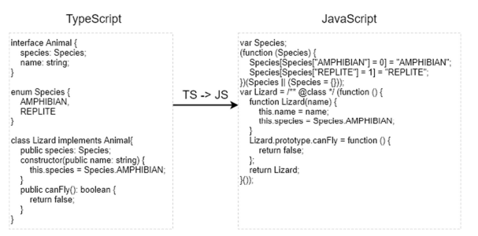
*rys. 6-7 Kompilacja języka TypeScript do języka JavaScript [źródło własne]*

Należy zwróć szczególną uwagę podczas pisania w języku TypeScript, ponieważ
zdefiniowane typ zmiennych oraz funkcji są usuwane podczas tłumaczenia na JavaScript. Wynika
to z tego, że w języku JavaScript nie ma typowania statycznego. Nawet jeżeli programista
zdefiniuje typ zmiennej lub funkcji w języku TypeScript, nie oznacza to, że w czasie wykonywania
programu, po kompilacji do języka JavaScript, typ ten zostanie sprawdzony. Należy o tym
szczególnie pamiętać jeżeli napisany program korzysta z API innych programów, np.: serwisów
internetowych.

### <a name="bootstrap"> Bootstrap

Bootstrap jest to darmowy, o otwartym kodzie źródłowym, framework do szybkiego
projektowania stron oraz aplikacji internetowych. Zawiera gotowe szablony, oparte na HTML’u
oraz CSS’ie, dla typografii, formularzy, tabel, przycisków, nawigacji i wiele więcej. Został
zaprojektowany i obecnie rozwijany przez programistów Twitter’a [43]. Obecnie jest drugim
najbardziej znanym repozytorium na platformie GitHub z 125 000 gwiazdkami [44]. Przykład
strony internetowej opartej na framework’u Bootstrap została przedstawiona na rys. 6-8. 

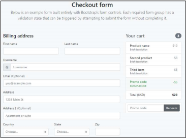
*rys. 6-8 Przykład strony internetowej zbudowanej w oparciu o framework Bootstrap [45]*

### <a name="front-awesome"> Front Awesome

Font Awesome to gotowy zestaw ikon oraz stylów utworzonych do użycia na stronach
internetowych. Pierwotnie zostały on zaprojektowane do użycia z bootstrap’em. Obecnie pakiet
ten składa się z 675 ikon [46] . Przykładowe ikony dostępne w pakiecie Font Awesome zostały
przedstawione na rys. 6-9.

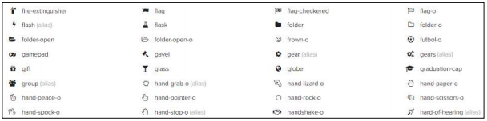
*rys. 6-9 Przykład dostępnych ikon dostępnych w pakiecie Font Awesome [47]*

## <a name="komunikacja-z-serwerem"> Komunikacja z serwerem

Większość aplikacji front-end’owych wymaga komunikacji z usługami internetowymi
(serwerami) za pośrednictwem protokołu http. Nowoczesne przeglądarki internetowe obsługują
dwa różne interfejsy API do tworzenia żądań http: „XMLHttpRequestinterfejs” oraz „fetch()”.
Framework Angular oferuje wbudowany, uproszczony moduł do połączeń http, który opiera się
na „XMLHttpRequestinterfejs”. 

Na rys. 6-10 został przedstawiony napisany kod, wykorzystujący opisany moduł o nazwie
„HttpClient”, służący do nawiązywania połączeń z napisanym serwisem internetowym
(serwerem). Wartość zmiennej „apiBaseUrl” jest nadawana podczas budowania aplikacji, w
zależności od kontekstu (środowiska deweloperskiego). 

```
@Injectable({ 
    providedIn: 'root'
})
export class ApiService {
    private serverUrl = environment.apiBaseUrl;
    constructor(private httpClient: HttpClient) { }

    get<T>(url: string, options?: Options): Observable<any> {
       return this.httpClient.get(`${this.serverUrl}${url}`, options); 
    }

    post<T>(url: string, body: any, options?: Options): { … }

    put<T>(url: string, body: any, options?: Options): { … }

    delete<T>(url: string): { … }

    patch<T>(url: string, body: any, options?: Options) { … }

    options(url: string, options?: Options) { … }
} 
```
*rys. 6-10 Fragment serwisu odpowiedzialnego za łączenie się z serwisem internetowym*

Serwis ten jest rdzeniem dla pozostałych serwisów służących do nawiązywania
„konkretnych” połączeń z serwerem. Przykład serwisu wykorzystującego serwis „ApiService”
został przedstawiony na rys. 6-11. Analogicznie został utworzy serwis „FormService” służący do
zarządzania formularzami przypisanymi do konkretnego folderu oraz „AuthService” służący do
uwierzytelniania użytkownika korzystającego z aplikacji.

```
@Injectable({ 
    providedIn: ‘root’ 
})
export class FolderService {
 constructor(private apiService: ApiService) {}

 getFolderTree(): Observable<FolderToRead[]> {
 return this.apiService.get(‘folders/‘);
 }

 getFolder(folderId: string): Observable<FolderToRead> {…}

 addFolder(folder: FolderToCreate): Observable<FolderToRead> {…}

 updateFolder(folder: FolderToUpdate): Observable<FolderToRead> {…}

 removeFolder(folderId: string): Observable<FolderToRead> {…}

} 
```
*rys. 6-11 Przykład napisanego serwisu, wykorzystującego „ApiService”, służącego do zarządzania strukturą folderów*

## <a name="proces-uwierzytelniania"> Proces uwierzytelniania 

Zaimplementowany serwis internetowy (opisany w poprzednim rozdziale) wymaga
uwierzytelnienia użytkownika korzystającego z API, w celu zabezpieczenia się przed modyfikacją
przez osoby niepowołane. W celu uzyskania uwierzytelnienia należy wysłać wraz z każdym
żądaniem nagłówek z loginem oraz hasłem w postaci tekstu, zakodowanego przez algorytm
„Base64”. Serwis odpowiedzialny za przechowywanie wpisanego loginu i hasła do aplikacji oraz
jego zakodowanie został przedstawiony na rys. 6-12.

```
@Injectable({ 
    providedIn: ‘root’ 
})
export class AuthService {
 private authTokenKey = ‘login_token’;

 constructor(private apiService: ApiService,

 private storageService: StorageService) { }

 private generateToken(data: LoginForm): string {
    return ‘Basic ${btoa(data.login + ‘:’ + data.password)}‘;
 }

 getAuthorizationHeaderKey(): string {
    return ‘Authorization’;
 }

 signIn(data: LoginForm): Promise<boolean> {
    const token = this.generateToken(data);
    return this.verifyToken(token);
 }

 private verifyToken(token: string): Promise<boolean>) { … }

 isLogin(): Promise<boolean> { … }

 logout(): Promise<void> ) { … }

 getAuthTokenFromMemory() { … }

 private removeAuthToken() ) { … }

 private saveAuthTokenToMemory(token: string) { … }

}

interface LoginForm { 
    login: string; 
    password: string; 
} 
```
*rys. 6-12 Fragment serwisu „AuthService” odpowiedzialnego za uwierzytelnianie użytkownika*

Oprócz samego serwisu odpowiedzialnego za przechowywanie informacji o aktualnie
zalogowanym użytkowniku potrzebny jest również mechanizm, którego zadaniem będzie
dodawanie do każdego żądania, wysłanego na serwer, nagłówka uwierzytelniającego (Basic
Auth). Angular umożliwia modyfikację każdego żądania, przed wysłaniem go na serwer, za
pomocą klasy, która implementuje interfejs „HttpInterceptor” [48]. Utworzona klasa,
implementująca wymieniony interfejs została przedstawiona na rys. 6-13.

```
@Injectable({ 
    providedIn: ‘root’ 
})
export class AuthInterceptor implements HttpInterceptor {
    constructor(private authService: AuthService) { }

    intercept(request: HttpRequest<any>, next: HttpHandler): Observable<HttpEvent<any>> {
        const authorizationHeaderValue = this.authService.getAuthTokenFromMemory();
        const authorizationHeaderKey = this.authService.getAuthorizationHeaderKey();

        if (request.headers.has(authorizationHeaderKey)) {
            return next.handle(request);
        } else {
            const updatedRequest = request.clone({
                headers: request.headers.set(
                authorizationHeaderKey, authorizationHeaderValue)
            });
            return next.handle(updatedRequest);
        }
    }
} 
```
*rys. 6-13 Serwis odpowiedzialny za wstrzykiwanie nagłówka z danymi służącymi do uwierzytelniania użytkownika*

Oprócz samego napisania interceptor’a należy go jeszcze „włączyć” do moduły głównego
napisanej aplikacji, tak jak pokazano na rys. 6-14. 

```
@NgModule({
    imports: […],
    providers: [ {
        provide: HTTP_INTERCEPTORS,
        useClass: AuthInterceptor,
        multi: true
    } ],
    (…)
}) 
export class CoreModule { } 
```
*rys. 6-14 Podpięcie „Interceptor’a” do moduły głównego aplikacji*

## <a name="projektowanie-formularza-machine-tool-specification"> Projektowanie formularza „Machine Tool Specification”

Formularz „Machine Tool Specification”, który ma zostać zaimplementowany, składa się
z czterdziestu czterech obiektów, które są ze sobą powiązane relacjami - jeden do jeden lub jeden
do wielu. Przed przystąpieniem do pisania formularzy, należy najpierw utworzyć modele
obiektów, które zostaną później wykorzystane do utworzenia formularzy. Na rys. 6-15 został
przedstawiony przykładowy model, który został utworzony w niniejszej aplikacji. Pozostałe
czterdzieści trzy modele zostały utworzone analogicznie. Dodatkowo każda klasa posiada funkcję
statyczną „getFormControls”, której zadaniem jest dostarczenie danych potrzebnych do
zbudowania formularza (takich jak np.: czy dane pole jest polem obowiązkowym). 

```
export class MachineToolSpecification extends MachineTool {
    machine_class: MachineClass = null;
    device_id: DeviceId = new DeviceId();
    location: Location = new Location();
    its_elements: MachineToolElement[] = [];
    (…)

    constructor(machineToolSpecification?) {
        super(machineToolSpecification);
        Object.assign(this, machineToolSpecification);
    }

    public static getFormControls(loadModel?) { … }
} 
```
*rys. 6-15 Fragment modelu “MachineToolSpecification”*

Oprócz samego modelu, ze względu na to, że model jest bardzo złożony, potrzebny jest
jeszcze serwis, który będzie odpowiedzialny za przechowywanie aktualnie edytowanego modelu.
Napisany serwis został przedstawiony na rys. 6-16. 

```
@Injectable({ 
    providedIn: ‘root’
})
export class MachineToolSpecificationFormService {
    machineToolSpecificationForm: FormGroup;

    constructor() { this.loadMachineToolSpecificationFormFromModel(); }
    
    get machine_class() {
        return this.machineToolSpecificationForm.controls[‘machine_class’]
    }

    get installationForm() {
        return this.machineToolSpecificationForm.controls[’installation’];
    }

    get standardMachiningProcessForm() {(…)}

    (…) // pozostałe pola
    
    loadMachineToolSpecificationFormFromModel( machineToolSpecification ={} ) {
    }

    (…)
} 
```
*rys. 6-16 Serwis odpowiedzialny za zarządzanie aktualnie edytowanym modelem*

Następnym krokiem jest już utworzenie wszystkich formularzy na podstawie napisanych
wcześniej modeli. Przykładowo utworzony komponent zawierający dany formularz został
przedstawiony na rys. 6-17. Ta czynność została wykonana analogicznie dla każdego modelu
(czterdzieści trzy razy).

```
// location-form.component.html
<inz-form [form]=”locationForm” [label]=”label” [required]=”required”>
  <inz-input controlName=”business_unit” label=”Business Unit”></inz-input>
  <inz-input controlName=”plant_location” label=”Plant Location”></inz-input>
  <inz-input controlName=”building” label=”Building”></inz-input>
  <inz-input controlName=”cell” label=”Cell”></inz-input>
</inz-form>

// location-form.component.ts
@Component({
  selector: ‘inz-location-form’,
  templateUrl: ‘./location-form.component.html’,
  styleUrls: [’./location-form.component.sass’]
})
export class LocationFormComponent {
  @Input() locationForm: FormGroup;
  @Input() label: string;
  @Input() required: boolean;
} 
```
*rys. 6-17 Utworzony formularz dla modelu o nazwie „Location”*

Kolejnym krokiem jest stworzenie komponentu, którego zadaniem będzie ściągnięcie
informacji z URL’a przeglądarki. Na jego podstawie zostanie pobrany odpowiedni model z
serwisu (opisanego powyżej) przechowywującego aktualnie edytowany model oraz przekazanie
odpowiednich parametrów do komponentu odpowiedzialnego za wyświetlenie formularza.
Przykładowo zaimplementowany komponent, wykonujące opisane czynności, wykorzystany w
niniejszej pracy, został przedstawiony na rys. 6-18. 

```
// turret.component.html
<inz-form-array [forms]=”turretForm” [formGroupGenerator]=”generator” label=”Turret”>
  <ng-template #controls let-index=”index”>
  <inz-turret-form [turretForm]=”turretForm.controls[index]”>
  </inz-turret-form>
  <inz-form-href [href]=”index + ‘/turret-contents’” label=”Turret contents”>
  </inz-form-href>
  </ng-template>
</inz-form-array>

// turret.component.ts
@Component({
  selector: ‘inz-turret’,
  templateUrl: ‘./turret.component.html’,
  styleUrls: [‘./turret.component.sass’] })
export class TurretComponent implements OnInit {
    turretForm: FormArray;
    generator = Turret.getFormControls;
    private machineToolElementId: number;

    constructor(private machineToolSpecificationFormService: MachineToolSpecificationFormService, private activatedRoute: ActivatedRoute) { }

    ngOnInit(): void {
        this.activatedRoute.params.subscribe( params => {
            this.machineToolElementId = +params[‘machineToolElementId’];
            this.turretForm = this.machineToolSpecificationFormService.getTurrets(this.machineToolElementId);
        });
    }
} 
```
*rys. 6-18 Przykładowy komponent odpowiedzialny za odczytanie aktualnej ścieżki na stronie internetowej oraz wyświetlenie odpowiedniego formularza*

Przedostatnim krokiem jest podpięcie komponentów do nawigacji tak, aby każdy z
formularzy ładował się w zależności od aktualnych potrzeb (od aktualnej ścieżki w przeglądarce).
Fragment logiki nawigacyjnej został przedstawiony na rys. 6-19. 

```
const routes: Routes = [
    {   path: ‘’,
        component: MachineToolSpecificationLayoutComponent,
        children: [
            {path: ‘’, component: MachineToolSpecificationComponent },
            {path: ‘installation’, component: InstallationComponent },
            {path: ‘machining-capabilities’, component: MachiningCapabilitiesComponent },
            {path: ‘device-id’, component: DeviceIdComponent },
            {path: ‘its-elements’, component: ItsElementsComponent },
            (…) // pozostała część nawigacji
        ],
    },
]; 
```
*rys. 6-19 Fragment obiektu przechowywującego logikę nawigacyjną, odpowiedzialną za ładowanie odpowiednich komponentów w zależności od aktualnej ścieżki w przeglądarce*

Ostatnim krokiem jest utworzenie modułu składającego się ze wszystkich utworzonych
komponentów oraz dołączenie obiektu z logiką nawigacyjną. Fragment utworzonego modułu
został przedstawiony na rys. 6-20. 

```
@NgModule({
 imports: [
    RouterModule.forChild(routes),
    (…)
 ],
 declarations: [
    StandardMachiningProcessComponent,
    StandardMachiningProcessFormComponent,
    (…) // pozostałe komponenty
 ]
})
export class MachineToolSpecificationModule { } 
```
*rys. 6-20 Fragment moduły składającego się z komponentów oraz nawigacji potrzebnych do wyświetlenia formularzy „Machine Tool Specification”*

Interfejs graficznego, napisanego moduły, został przedstawiony na rys. 6-21. Moduł ten
składa się jeszcze z kilku widoków podrzędnych, jednak wszystkie wyglądają analogicznie do
przedstawionego.


*rys. 6-21 Wygląd utworzonego formularza implementującego normę ISO 14649-201 [źródło własne]*

## <a name="projektowanie-funkcjonalnosci-do-tworzenia-formularzy"></a> Projektowanie funkcjonalności do tworzenia formularzy


Aplikacja, oprócz możliwości dodawania kolejnych rekordów danych za pomocą
formularza „Machine Tool Specification”, ma oferować możliwość tworzenia własnych,
„płaskich” formularzy, składających z dowolnej liczy pól. W celu dostarczenia tej funkcjonalności
należy utworzyć dwa kolejne widoki:
* widok, za pomocą którego użytkownik będzie mógł tworzyć szablon formularza
* widok umożliwiający łatwe dodawania kolejnych porcji danych za pomocą formularza utworzonego na podstawie dostarczonego szablonu

## <a name="tworzenie-szablonu-formularza"></a> Tworzenie szablonu formularza

Aby móc tworzyć własne formularze należy utworzyć formularz, za pomocą którego
użytkownik będzie mógł definiować właściwości poszczególnych pól. Każde pole w formularzu
będzie składać się z trzech właściwości:

* klucza – nazwa ta zostanie wysłana na serwer i zapisana jako klucz w bazie, w związku z tym, w nazwie pola nie mogą znajdować się znaki specjalne takie jak np.: &, %, ., # itp.
* etykiety – etykieta odpowiedzialna jest za opisywanie wybranego pole
* typu – typ określa, czy do danego pola będzie można wpisać tekst, czy liczbę

Gdy znane są już właściwości pól potrzebnych do uzupełnienia przez użytkownika,
kolejnym krokiem jest utworzenie odpowiedniej logiki. Logika ta ma zapewniać dynamiczne
dodawanie kolejnych pól z możliwością wpisania wyżej wymienionych właściwości oraz
właściwą walidacją. Napisane funkcje zostały przedstawione na rys. 6-22

```
// funkcja do zainicjowania nowego formularza
buildForm(): FormGroup {
    return new FormGroup({
        name: new FormControl(‘’, Validators.required),
        inputs: new FormArray([this.createInputFormGroup()])
    }); 
}

// funkcja służaca do generowania kolejnego wiersza
createInputFormGroup() {
    return new FormGroup({
        name: new FormControl(‘’, [Validators.required, validateSpecialChars]),
        label: new FormControl(‘’, Validators.required),
        type: new FormControl(this.inputTypes.text, Validators.required),
    });
}

// funckja służaca do dodania kolejnego wiersza do modelu
addRow() { this.inputs.push(this.createInputFormGroup()); }
```
*rys. 6-22 Funkcje służące do zbudowania formularza oraz do dodawania kolejnych wierszy*

Po zaprojektowaniu oraz napisaniu logiki komponentu odpowiedzialnego za zarządzanie
szablonem formularza, następnym krokiem jest napisania logiki widoku. Widok ten, na podstawie
modelu dostępnego w komponencie, wyświetli dostępne pola. Logika widoku została
przedstawiona na rys. 6-23.

```
<inz-form [form]=’inputs.controls[i]’ *ngFor=”let control of inputs.controls;let i=index”>
    <div class=”row”>
        <div class=”col-12 col-md-4”>
            <inz-input controlName=”name”></inz-input>
        </div>
        <div class=”col-12 col-md-4”>
            <inz-input controlName=”label”></inz-input>
        </div>
        <div class=”col-12 col-md-3”>
            <inz-input controlName=”type” type=”select” [options]=”inputTypes”></inz-input>
        </div>
        <div class=”col-12 col-md-1 text-right”>
            <button (click)=”removeRow(i)” [disabled]=”hasBeenSaved” class=”btn btn-danger”>
                <span class=”fa fa-times”></span> 
            </button>
        </div>
    </div>
</inz-form>

<!--- pozostała część widoku -->
<button (click)=”addRow”>Add new field</button>

<!--- pozostała część widoku -->
<button (click)=”save()”>Save form</button>
```
*rys. 6-23 Fragment szablonu komponentu odpowiedzialny za wyświetlanie poszczególnych wierszy formularza*

Oprócz samej logiki odpowiedzialnej za zarządzaniem modelem oraz widokiem
szablonu, należy jeszcze umożliwić wysłanie schematu formularza na serwer w celu jego zapisania
oraz późniejszego wczytania do pamięci aplikacji. W tym celu została utworzona specjalna funkcja
w komponencie, opisana na rys. 6-24. Funkcja ta wykonuje się po kliknięciu na stronie w przycisk
„Save form”.

```
save() {
    // pobranie wartości z formularza
    const formData = this.formGroup.getRawValue();

    // podpięcie schematu formularza do folderu
    formData.folder = this.folderId;

    // wysłanie formularza na serwer
    this.formService.addNewForm(formData).subscribe(savedModel => {
        this.formNotificationService.formHasBeenSaved();
        this.hasBeenSaved=true; }, error => {this.formNotificationService.formExist(); }
    );
}
```
*rys. 6-24 Funkcja służąca do zapisania utworzonego schematu formularza*

Widok graficzny zaprojektowanego komponentu, odpowiedzialnego za generowanie
formularzy, został przedstawiony na rys. 6-25.

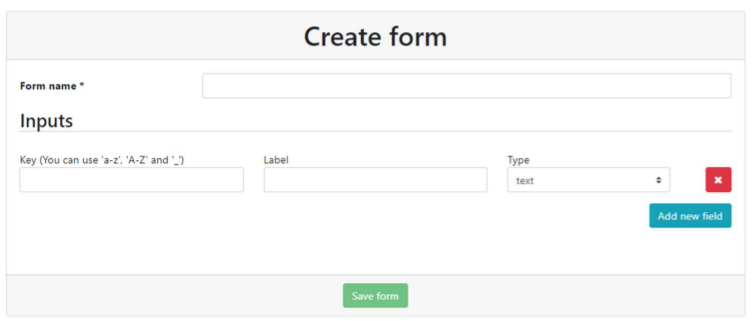
*rys. 6-25 Widok utworzonego generatora do tworzenia własnych formularzy [źródło własne]*

### <a name="tworzenie-widoku-do-uzupełniania-formularza"></a> Tworzenie widoku do uzupełniania formularza

Utworzony widok, po uruchomieniu, pobiera dane z serwisu na postawie obecnej ścieżki
w przeglądarce. Napisana funkcja, której zadaniem jest pobranie danych z serwisu oraz
zmapowanie ich na model do budowania formularza, wykorzystana w komponencie, została
przedstawiona na rys. 6-26.

```
ngOnInit() {
    this.activatedRoute.paramMap // pobranie parametrów ze ścieżki
        .subscribe(value => {
            this.formId = value.get(‘formId’);
            this.recordId = value.get(‘recordId’);
            // ściągnięcie oraz zbudowanie formularza
            this.fetchFormInputsAndBuild();
        });
}

// funkcja odpowiedzialna za zbudowanie formularza na podstawie danych z serwera
private buildForm(initValues: FormRecordDTO = {values: {}}) {
    const temp = {};
    this.formInputs.forEach(input => {
        const initValue = initValues.values[input.name] ?
        initValues.values[input.name] : null;
        temp[input.name] = new FormControl(initValue);
    });
    this.formGroup = new FormGroup(temp);
}
```
*rys. 6-26 Funkcje odpowiedzialne za pobranie schematu formularza z serwera oraz zmapowanie otrzymanego modelu na model do tworzenia formularza*

Po pobraniu danych z serwisu, kolejnym krokiem jest wygenerowanie formularza.
Fragment szablonu komponentu odpowiedzialnego za generowanie formularza na podstawie
dostarczonego modelu została przedstawiona na rys. 6-27.

```
<inz-form [form]=”formGroup”>
    <inz-input *ngFor=”let input of formInputs” [label]=”input.label”
        [type]=”input.type” [controlName]=”input.name”></inz-input>
</inz-form>
```
*rys. 6-27 Fragment szablonu HTML odpowiedzialnego za generowanie formularza na podstawie dostarczonego modelu*

W celu zapisania danych na serwerze, które zostały wpisane do formularza, została
napisana funkcja, która pobiera wpisane dane, po czym wywołuje odpowiednią funkcję z serwisu,
odpowiedzialnego za komunikację z serwerem, w zależności od tego, czy dany model posiada
zdefiniowany identyfikator. Funkcja ta została przedstawiona na rys. 6-28.

```
save() {
    // pobranie danych z formularza
    const formData = this.formGroup.getRawValue();

    // jeżeli jest podane ID rekordu - zaktualizuj
    if (this.recordId) {      
        this.updateFormRecord( { _id: this.recordId, values: formData } );
    } else {
        // w przeciwnym wypadku utwórz nowy
        this.createFormRecord(formData);
    }
}
```
*rys. 6-28 Funkcja odpowiedzialna za wysłanie uzupełnionego formularza na serwis internetowy*

Układ graficzny komponentu, odpowiedzialnego za dodawanie kolejnych rekordów,
został przedstawiony na rys. 6-29.


*rys. 6-29 Układ graficzny komponentu do dodawania kolejnych rekordów do utworzonego wcześniej formularza [źródło własne]*

## <a name="projektowanie-panelu-glownego-strony"></a>  Projektowanie panelu głównego strony

Panel główny aplikacji internetowej ma oferować użytkownikowi końcowemu zestaw
narzędzi, za pomocą których będzie mógł zarządzanie strukturą folderów. Oznacza to, że musi
posiadać możliwość dodawania folderu głównego, folderu podrzędnego, usunięcie wybranego
folderu oraz dodatkowo umożliwić edytowanie jego nazwy w razie popełnienia błędu podczas
wpisywania nazwy. W panelu głównym ma się również znaleźć miejsce do wyświetlania
zawartości danego formularza, przypisanego do określonego folderu. Aby sprostać tym
wymaganiom strona zostanie podzielona wertykalnie na dwie części. Po lewej zostanie
wyświetlona struktura folderów, natomiast po prawej zawartość formularza. Zaprojektowany
widok panelu głównego został przedstawiony na rys. 6-30.

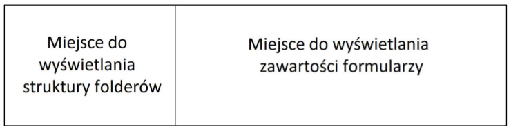
*rys. 6-30 Zaprojektowany widok panelu głównego [źródło własne]*

### <a name="implementacja-modulu-do-zarzadzania-folderami"></a> Implementacja modułu do zarządzania folderami

Do zarządzania strukturą folderów został utworzony specjalny moduł o nazwie
„FolderTreeModule ”. Moduł ten składa się z trzech komponentów oraz jednego serwisu:
* FolderNodeComponent - komponent ten odpowiedzialny jest za odtworzenie
struktury folderów na podstawie dostarczonego modelu danych. Model jaki został
napisany, na podstawie którego tworzona jest struktura folderu został przedstawiona
na rys. 6-31.
* FolderNodeContentComponent - komponent ten odpowiedzialny jest za
wyświetlenie danego folderu.
* FolderNodeEditComponent - komponent ten przechowuje formularz, który może
posłużyć do utworzenia lub edycji danego folderu.
* FolderTreeService - serwis ten odpowiedzialny jest za przechowywanie informacji o
aktualnie zaznaczonym folderze, o jego stanie (informacje ze są zapisywane w
pamięci podręcznej przeglądarki) oraz za propagowanie informacji o tym, że dany
folder został odznaczony lub zaznaczony.

```
export class Folder {
    id = ‘’;
    children: Folder[];
    name = ‘’;
    parent? = ‘’;
    isOpen = false;
}
```
*rys. 6-31 Model, na podstawie którego tworzona jest hierarchiczna struktura folderów*

### <a name="wyswietlania-zawartosci-wybranego-folderu"></a> Wyświetlania zawartości wybranego folderu

Do wyświetlania zawartości zaznaczonego folderu zostały utworzone dwa moduły:
* FormsDisplayModule – moduł ten odpowiedzialny jest za wyświetlanie zawartości
folderu, gdy dany formularz jest formularzem utworzonym przez użytkownika (nie
jest predefiniowany przez samą aplikację). Moduł ten składa się z jednego
komponentu „FormsDisplayComponent”.
* MachineToolDisplayModule – moduł odpowiedzialny za wyświetlanie zawartości,
gdy dany formularz jest formularzem predefiniowanym przez aplikację. Oznacza to,
że serwis internetowy nie posiada żadnych informacji o tym, jak wygląda struktura
formularza. Wszystkie te informacje przechowywane są w samej aplikacji klienckiej
(takim formularzem jest formularz o nazwie „Machine Tool Specification”). Moduł
ten składa się z jednego komponentu „MachineToolDisplayComponent”.

### <a name="implementacja-funkcji-do-generowania-xmla"></a>  Implementacja funkcji do generowania XML’a

W celu wygenerowania pliku XML z zawartością danego formularza należy
zaimplementować algorytm (konwerter), który zamieni obiekt JavaScript na plik XML’owy. W
związku z tym, że w Internecie istnieje już darmowe narzędzie, nie ma potrzeby pisać własnego
algorytmu. Narzędzie, jakie zostało wykorzystane w owym celu nosi nazwę „xml-js”. Przykład
zastosowania narzędzia do konwertowania do formatu XML’a został przedstawiony na rys. 6-32.

```
import * as converter from ‘xml-js’;

const js = {
    obrabiarka : {
    nazwa: „obrabiarka”,
    rozmiar: [323,656, 233] }
};
const result = converter.js2xml(xml, {compact: true, spaces: 4});

// wynik działania
<obrabiarka>
    <nazwa>obrabiarka</nazwa>
    <rozmiar>323</rozmiar>
    <rozmiar>656</rozmiar>
    <rozmiar>233</rozmiar>
</obrabiarka>
```
*rys. 6-32 Przykład działania biblioteki do konwertowania obiektu JavaScript do formatu XML*

### <a name="implementacja-panelu-głównego"> Implementacja panelu głównego

W związku z tym, że zostały już utworzone wszystkie moduły wymagane do utworzenia
strony głównej, można przystąpić do pisania modułu odpowiedzialnego za wyświetlanie panelu.
Moduł ten składa się z modułów opisanych w poprzednich podrozdziałach, z komponentu
„DashboardComponent” oraz odpowiednich serwisów. Najważniejsze fragmenty pliku HTML,
komponentu „DashboardComponent”, zostały przedstawione na rys. 6-34.

```
<div class=”folders border border-left-0 border-top-0 border-bottom-0 border-dark”>
    <div class=”folders-actions”>
        <div>
            <button (click)=”addNewCollection()” title=”Add root folder”
                     class=”btn btn-outline-secondary btn-sm mr-1”>
                <span class=”fa fa-folder”></span>
            </button>
            <!-- Pozostałe przycisku służące do zarządzania strukturą folderów -->
        </div>
    </div>

    <!--użycie komponentu do wyświetlania struktury folderów-->
    <inz-folder-node [folders]=”tree”></inz-folder-node>
</div>

<div class=”folder-content” *ngIf=”hasSelectedFolderForm”>
    <!-- użycie komponentów do wyświetlania zawartości zaznaczonego folderu -->
    <ng-container *ngIf=”!selectedForm.predefined”>
        <inz-forms-display [formId]=”selectedFolderId”></inz-forms-display>
        <!-- pozostała część kodu -->
    </ng-container>
    <ng-container *ngIf=”selectedForm.predefined”>
        <inz-machine-tool-display [formId]=”selectedFolderId”></inz-machine-tool-display>
        <!-- pozostała część kodu -->
    </ng-container>
</div>
```
*rys. 6-33 Najważniejsze fragmenty kodu służące do wyświetlania wyglądu panelu głównego aplikacji*

Ze względu na to, że model danych, który jest pobierany z serwisu różni się od modelu,
jaki został zaprojektowany w komponencie, należy przeprowadzić konwertowanie formatu
danych. Do tego działania została utworzona funkcja o nazwie „convertFolderToReadToFolderModel”.

@Component({
    selector: ‘inz-dashboard’,
    templateUrl: ‘./dashboard.component.html’,
    styleUrls: [’./dashboard.component.sass’]
})
export class DashboardComponent implements OnInit {
    public tree: Folder[] = [];
    contructor(private folderService: FolderService){}

    // pozostała część logiki komponentu
    // (...)

    // pobranie danych z serwisu
    private fetchFolderTree() {
        this.folderService.getFolderTree()
        .pipe( map(items => convertFolderToReadToFolderModel(items)) )
        .subscribe(folders => this.tree = folders);
    }
}
*rys. 6-34 Fragment komponentu panelu głównego aplikacji*

Układ graficzny, zaimplementowanego panelu głównego, został przedstawiony na rys. 6-36.

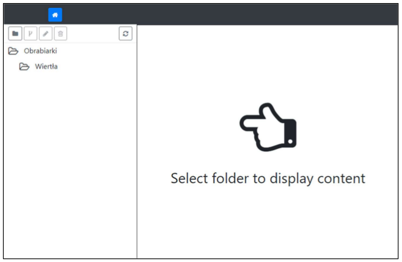
*rys. 6-35 Wygląd zaimplementowanego panelu głównego [źródło własne]*

## <a name="utworzenie-modulu-glownego"> Utworzenie modułu głównego

Każda aplikacja Angular’owa musi składać się z jednego moduły głównego. Moduł ten
jest odpowiedzialny za import utworzonych modułów, komponentów oraz serwisów. Oprócz tego,
w module głównym definiuje się korzeń nawigowania po aplikacji. Podgląd napisanego modułu
głównego został przedstawiony na rys. 6-23.

```
@NgModule({
    declarations: [ AppComponent ],
    imports:[SharedModule, CoreModule, LayoutModule, AppRoutingModule],
    bootstrap: [AppComponent]
})
export class AppModule { }
```
*rys. 6-36 Główny moduł aplikacji importujący pozostałe moduły*

„AppRoutingModule” jest to moduł odpowiedzialny za zdefiniowanie głównego
schematu nawigowania po aplikacji w zależności od aktualnej ścieżki w przeglądarce. Dodatkowo
moduł ten posiada zaimplementowany serwis „AuthGuardService”, który odpowiada za
sprawdzenie, czy osoba korzystająca z aplikacji przeszła proces uwierzytelniania. Jeżeli nie,
użytkownik zostanie przekierowany na stronę logowania. Podgląd schematu nawigowania po
aplikacji został przedstawiony na rys. 6-37.

```
const routes: Routes = [ 
    {
        path: ‘dashboard’,
        loadChildren: ‘./dashboard/dashboard.module#DashboardModule’,
        canActivate: [AuthGuardService]
    },
    {
        path: ‘forms’,
        loadChildren: ‘./forms/forms.module#FormsModule’,
        canActivate: [AuthGuardService]
    },
    {
        path: ‘auth’,
        loadChildren: ‘./auth/auth.module#AuthModule’,
    },
    {
        path: ‘**’,
        redirectTo: ‘/dashboard’
    },
];
```
*rys. 6-37 Konfiguracja głównej nawigacji po aplikacji*

## <a name="przygotowanie-aplikacji-do-uruchomienia"> Przygotowanie aplikacji do uruchomienia

Aby móc uruchomić aplikację należy mieć zainstalowany program Angular CLI. Program
ten umożliwia uruchomienie aplikacji Angular’owej w jednej z dwóch wersji: wersji
deweloperskiej od produkcyjnej (docelowo aplikacja zostanie dostarczona w wersji produkcyjnej).

Wersja deweloperska to wersja, w której cała aplikacja jest budowana, a następnie
uruchamiany jest serwer, który przechowuje w pamięci komputera zbudowane pliki. Dodatkowo
serwer ten nasłuchuje pliki źródłowe i automatycznie przebuduje aplikację po każdej zmianie.
Takie działanie powoduje, że rozwijanie aplikacji jest względnie szybkie, jednak wiąże się z
użyciem większej ilości zasób komputera w porównaniu z wersją produkcyjną.

Wersja produkcyjna to wersja, gdzie cała aplikacja jest budowana, a następnie
dostarczana w postaci najczęściej pojedynczego pliku. W tej wersji programista musi sam zadbać
o serwer, który będzie dostarczał pliki źródłowe przeglądarce internetowej. Ze względu na to, że
zbudowane pliki są przechowywany na dysku, a nie w pamięci komputera, powoduje to mniejsze
zużycie zasób w porównaniu z wersją deweloperską. Proces budowania aplikacji w wersji
produkcyjnego został przedstawiony na rys. 6-38.

```
# instalacja wymaganych pakietów
$ npm install

# zbudowanie aplikacji
$ zbudowanie aplikacji
```
*rys. 6-38 Lista komend potrzebnych do zbudowania aplikacji front-end’owej*

Kolejnym krokiem jest uruchomienie serwera, którego zadaniem będzie udostępnianie
zbudowanych plików. W tym celu został wykorzystany program Nginx, który został odpowiednio
skonfigurowany. Napisana konfiguracja została przedstawiona na rys. 6-39.

```
server {
    listen 80;
    sendfile on;
    root /inz-front-end;
    location / {
        try_files $uri $uri/ /index.html =404;
    }
}
```
*rys. 6-39 Konfiguracja programu Nginx do udostępniania plików zbudowanej aplikacji*

## <a name="ograniczenia"> Ograniczenia

Angular posiada wsparcie tylko dla najnowszych wersji przeglądarek. Oznacza to, że
osoba korzystająca ze starszych lub nieobsługiwanych przeglądarek może nie być wstanie
otworzyć strony, lub wyświetlana strona internetowa nie będzie działać, lub wyświetlać się
poprawnie. Lista przeglądarek, które najprawdopodobniej są wstanie uruchomić napisaną
aplikację została przedstawiona w tab. 6-1.

// ToDo: Add table with supported browsers

Kolejnym ograniczeniem jest dla aplikacji jest minimalna rozdzielczość ekranu
urządzenia, na którym dana strona zostanie wyświetlona. Napisana aplikacja została
zaprojektowania z myślą o ekranach komputerów stacjonarnych oraz laptopach, których szerokość
wynosi co najmniej 1000px. Poniżej też rozdzielczości niektóre postronny aplikacji będą
wyświetlać się nieprawidłowo uniemożliwiając tym samym swobodne korzystanie z aplikacji.