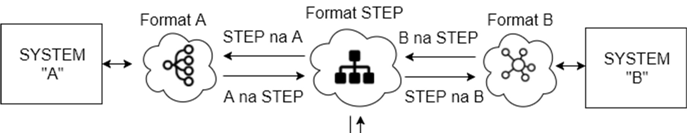
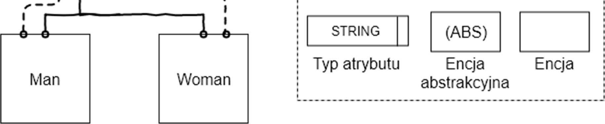
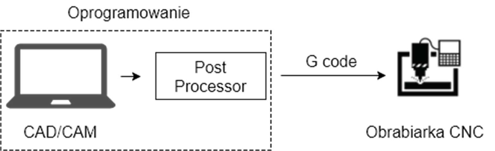
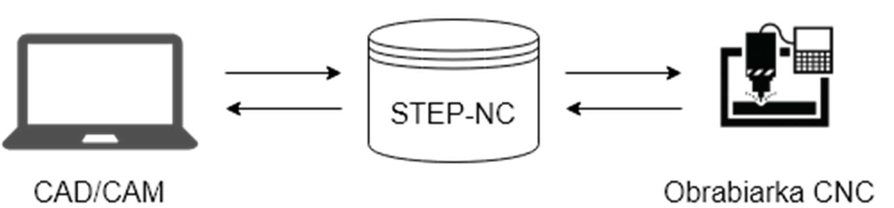
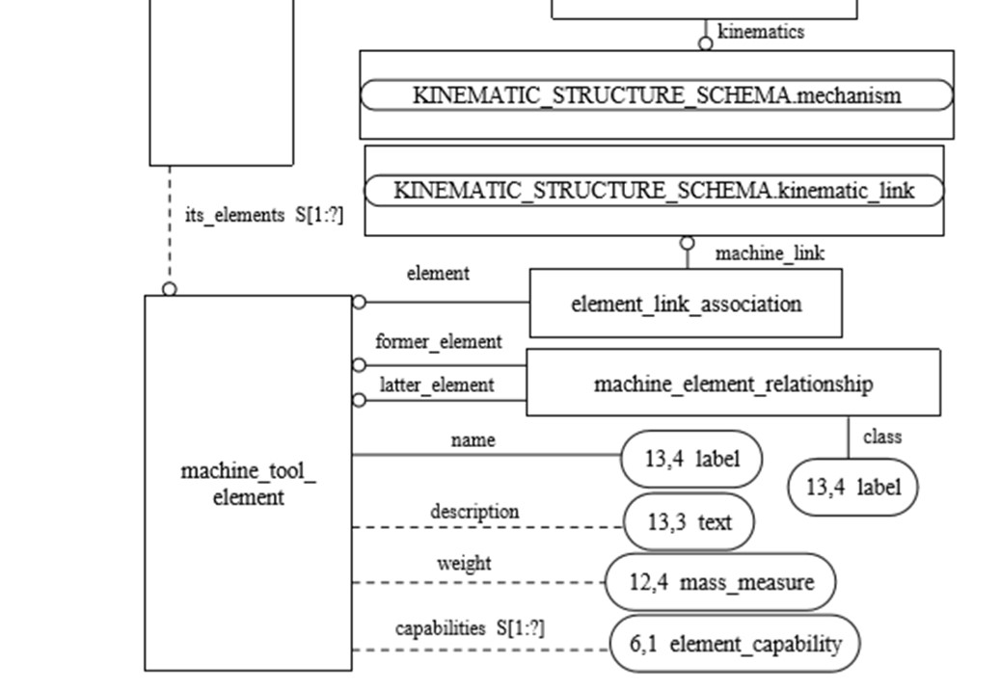
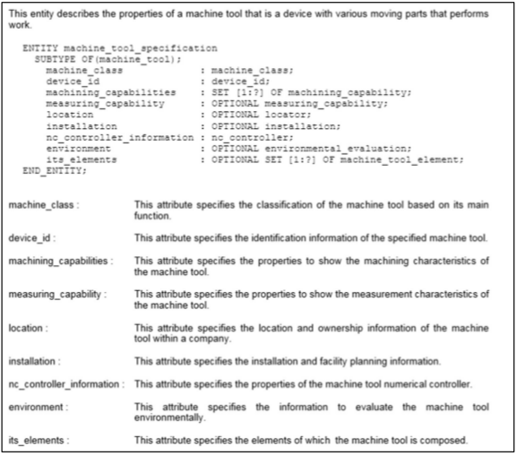
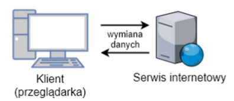
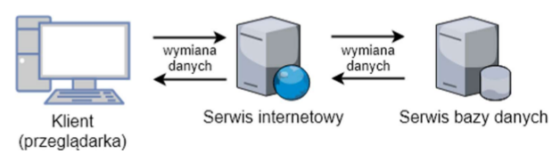
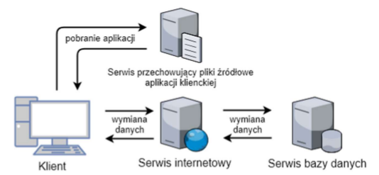
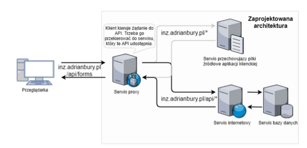

# Spis treści

* * *

1. [CEL I ZAKRES PRACY](#cel-i-zakres-pracy)
2. [WSTĘP](#wstep)
3. [WPROWADZENIE DO NORMY STEP](#wprowadzanie-do-normy-step)
    1. [NORMA STEP](#norma-step)
    2. [JĘZYK EXPRESS ORAZ EXPRESS-G](#jezyk-express-oraz-express-g)
    3. [STEP-NC](#step-nc)
    4. [NORMA ISO 14649](#norma-iso-14649)
    5. [NORMA ISO 14649 – CZĘŚĆ 201](#norma-iso-14649-czesc-201)
4. [PROJEKTOWANIE ARCHITEKTURY SYSTEMU APLIKACJI](#projektowanie-architektury-systemu-aplikacji)
    1. [OMÓWIENIE STRUKTURY TYPU KLIENT - SERWER](#omownie-struktury-typu-klient-serwer)
    2. OMÓWIENIE PROTOKOŁU KOMUNIKACJI POMIĘDZY PRZEGLĄDARKĄ A SERWEREM - POŁĄCZENIE HTTP
    3. RODZAJE STRON INTERNETOWYCH
    4. KOMUNIKACJA MIĘDZY APLIKACJAMI - API
    5. ARCHITEKTURA API - REST
    6. PLANOWANIE API ZGODNIE Z ZASADAMI REST
    7. PROJEKTOWANIE API DLA SERWISU INTERNETOWEGO
    8. PROXY 
    9. BAZA DANYCH 
5. IMPLEMENTACJA SERWISU INTERNETOWEGO
    1. OMÓWIENIE ŚRODOWISKA NODE.JS ORAZ FRAMEWORK'A EXPRESS.JS 
    2. OMÓWIENIE MENEDŻERA PAKIETÓW JS – NPM
    3. ZAPROJEKTOWANIE ARCHITEKTURY SERWISU 
    4. PLIK KONFIGURACYJNY
    5. MONGOOSE – BIBLIOTEKA DO ZARZĄDZANIE BAZĄ DANYCH M ONGO DB
    6. TWORZENIE SERWISÓW
    7. TWORZENIE KONTROLERÓW
    8. UWIERZYTELNIENIE UŻYTKOWNIKA
    9. MODUŁ GŁÓWNY APLIKACJI 
    10. URUCHOMIENIE APLIKACJI
6. IMPLEMENTACJA APLIKACJI PRZEGLĄDARKOWEJ 
    1. OMÓWIENIE FRAMEWORK'A A NGULAR 
    2. OMÓWIENIE WYKORZYSTANYCH NARZĘDZI FRONT - END'OWYCH
    3. KOMUNIKACJA Z SERWEREM
    4. PROCES UWIERZYTELNIANIA 
    5. PROJEKTOWANIE FORMULARZA "MACHINE TOOL SPECIFICATION"
    6. PROJEKTOWANIE FUNKCJONALNOŚCI DO TWORZENIA FORMULARZY 
    7. PROJEKTOWANIE PANELU GŁÓWNEGO STRONY
    8. UTWORZENIE MODUŁU GŁÓWNEGO
    9. PRZYGOTOWANIE APLIKACJI DO URUCHOMIENIA
    10. OGRANICZENIA
7. KONFIGUROWANIE SERWISU PROXY 
    1. OMÓWIENIE SERWISU N GINX
    2. KONFIGURACJA N GINX 
8. PRZYGOTOWANIE SYSTEMU APLIKACJI DO URUCHOMIENIA 
    1. DOCKER
    2. PLIK KONFIGURACYJNY DO BUDOWANIA OBRAZÓW D OCKER'OWYCH 
    3. AUTOMATYCZNE BUDOWANIE ORAZ UDOSTĘPNIANIE OBRAZÓW 
    4. COMPOSE – ZDEFINIOWANE PLIKU KONFIGURACYJNEGO
    5. ZARZĄDZANIE SERWISAMI 
9. TESTOWANIE APLIKACJI
    1. ZALOGOWANIE SIĘ DO APLIKACJI 
    2. UTWORZENIE NOWEGO FOLDERU GŁÓWNEGO 
    3. UTWORZENIE FORMULARZA "MACHINE TOOL SPECIFICATION"
    4. DODANIE NOWYCH REKORDÓW DO FORMULARZA
    5. GENEROWANIE PLIKU XML 
    6. TWORZENIE WŁASNEGO FORMULARZA 
    7. PODGLĄD ZAWARTOŚCI BAZY DANYCH 
10. STATYSTYKI ORAZ WYKORZYSTANE NARZĘDZIA 
11. PODSUMOWANIE 
12. DYSKUSJA 
13. SUMMARY
14. LITERATURA
15. SPIS ILUSTRACJI
16. SPIS TABEL 
17. ANEKS 

# <a name="cel-i-zakres-pracy"></a> Cel i zakres pracy

* * *

Celem niniejszej pracy dyplomowej jest utworzenie aplikacji internetowej, z możliwością
jej uruchomienia z dowolnej, najnowszej przeglądarki internetowej na komputerze osobistym,
która ma umożliwić użytkownikowi wprowadzenie oraz zapisywanie danych technicznych
obrabiarek zgodnie z normą ISO 14649-201 (opisy obrabiarek objęte tym schematem to frezarki,
centra obróbcze, tokarki i wielozadaniowe maszyny). Aplikacja ma udostępniać również
funkcjonalność do generowania pliku XML na podstawie wprowadzonych danych. Oprócz tego,
aplikacja ma umożliwiać tworzenia własnych, prostych formularzy. Aby aplikacja była łatwa w
obsłudze zostanie również zaimplementowana funkcjonalność do tworzenia katalogów oraz
podkatalogów w celu umożliwienia segregowania formularzy według upodobań użytkownika.
Aplikacja ma być łatwa do instalacji oraz intuicyjna. W tym celu należy wykonać następujące
kroki:
1. Sformułowanie koncepcji budowy systemu aplikacji
2. Wybór sposobu komunikacji pomiędzy poszczególnymi komponentami systemu
3. Wybór odpowiednich technologii oraz narzędzi
4. Implementacja poszczególnych komponentów systemu
5. Uruchomienie systemu aplikacji
6. Testowanie systemu


# <a name="wstep"></a> Wstęp

* * *

Nowoczesne zakłady produkcyjne są budowane na całym świecie, które zawierają sprzęt
oraz oprogramowanie od różnych producentów. Ogromne ilości informacji o produktach muszą
być przesyłane między różnymi urządzeniami i maszynami. Przez to, że każdy system posiada
własne formaty danych, te same informacje muszą być wprowadzane wielokrotnie, prowadząc do
nadmiarowości i błędów [1]. W celu rozwiązania opisanego problemu powstała Międzynarodowa
Organizacja Normalizacyjna (ISO), której celem jest ułatwienie międzynarodowej koordynacji i
unifikacji standardów przemysłowych.

Jedną z norm zdefiniowaną przez ISO jest norma oznaczona numerem 14649-201, będącą
częścią normy STEP oraz STEP-NC. Norma ta definiuje obiektową strukturę danych, która
jednoznacznie charakteryzuje dostępne obrabiarki (frezarki, centra obróbcze, tokarki i
wielozadaniowe maszyny). Dzięki takiemu standardowi dowolny producent obrabiarek może
przekazywać dane do dowolnego systemu CAD/CAM, a producenci systemów CAD/CAM mogą
wymieniać między sobą dane bez konieczności integracji z każdym z dostępnych systemów
osobno.

Niniejsza praca inżynierska ma na celu stworzenie aplikacji, za pomocą której
użytkownik będzie mógł wprowadzić, zapisać a następnie wyeksportować wprowadzone dane
techniczne obrabiarki do formatu XML. Wszystko to zgodnie z normą ISO 14649-201.


# <a name="wprowadzanie-do-normy-step"></a> Wprowadzenie do normy STEP

* * *

## <a name="norma-step"></a> Norma STEP

Nazwa STEP (Standard for the Exchange of Product Model Data) jest to powszechne
określenie normy ISO 10303. STEP zajmuje się danymi o produktach z projektowania
mechanicznego i elektrycznego, wymiarowaniem geometrycznym i tolerancją, analizą i
produkcją, a także dodatkowymi informacjami specyficznymi dla różnych branż, takich jak
motoryzacja, przemysł lotniczy, budownictwo, przemysł stoczniowy, ropa i gaz, przetwarzanie
roślinnych surowców i wiele inne. Zakres ten stale się powiększa, gdyż wydawane są nowe części
normy. Części te są nazywane ISO 10303-xxx, gdzie xxx jest numerem części, a każda jest
standardem samym w sobie, mimo że jest składnikiem większej całości i współzależna od innych
części [2]. Na rys. 3-1 został przedstawiony schemat ideowy normy STEP.


*rys. 3-1 Wymiana danych pomiędzy różnymi systemami [źródło własne]*

Podobnie jak inne normy ISO, STEP jest chroniony prawami autorskimi ISO i nie jest
swobodnie dostępny. Jednak schematy 10303 EXPRESS są udostępniane bezpłatnie, podobnie jak
zalecane praktyki dla wdrażających normę [3]


## <a name="jezyk-express-oraz-express-g"></a> Język EXPRESS oraz EXPRESS-G

EXPRESS to bogaty i dojrzały język służący do definiowania obiektowych schematów
danych. Jest on częścią standardu STEP (ISO 10303) i jest szeroko stosowany w modelowaniu
danych dla zastosowań przemysłowych na dużą skalę, w tym do produkcji, inżynierii, platform
wiertniczych, zakładów przetwórczych itp. Jest wykorzystywany wszędzie tam, gdzie
projektowanie jest wspomagane komputerowo (systemy CAD). Jest on używany do opisania i
konfiguracji trójwymiarowej geometrii części stałych oraz i zespołów tych części w różnego 
rodzaju maszynach, począwszy od samochodów, po samoloty, skończywszy na platformach
wiertniczych, statkach i elektrowniach. Jego celem jest uwolnienie danych CAD od zależności
zastrzeżonych systemów komputerowych i formatów, a tym samym umożliwienie wymiany
danych opisujących wytwarzane produkty między systemami podczas projektowania procesu
produkcyjnego [4].

Użyteczność tego języka sprawiła, że musiał sprostać wyzwaniom wykraczającym poza
pierwotne przewidywania. Oprócz kształtu i konfiguracji produktu, jego wymagań projektowych
oraz instrukcji obsługi, należało również opisać historię obsługi i użytkowania w firmie. W
przypadku dużego lub kosztownego produktu informacje o cyklu życia mogą być co najmniej tak
samo ważne jak opis jego fizycznej konfiguracji. Informacje mogą być potrzebne w czasie
rzeczywistym pomiędzy wieloma użytkownikami w środowisku sieciowym, a nie tylko
wymieniane okresowo, co było pierwotną intencją STEP.

EXPRESS jest językiem leksykalnym o charakterze obiektowym, jest podobny do
języków programowania takich jak Pascal, czy C. Na rys. 3-2 został przedstawiony przykładowy
zapis schematu „Family” w języku EXPRESS.

```
SCHEMA Family;

ENTITY Human
    ABSTRACT SUPERTYPE OF (ONEOF (Man, Woman));
    name: STRING;
    mother: OPTIONAL Woman;
    father: OPTIONAL Man;
END_ENTITY;

ENTITY Man
    SUBTYPE OF (Human);
END_ENTITY;

ENTITY Woman
    SUBTYPE of (Human);
END_ENTITY;

END_SCHEMA;
```
*rys. 3-2 Model schematu "Family" zapisany w języku EXPRESS*

Schemat „Family” zawiera encję („ENTITY”) o nazwie „Human”. Encja ta została
oznaczona jako abstrakcyjna („ASBSTRACT”). Powoduje to, że nie może być tworzona
samodzielnie, ale może być podtypem innej encji. W tym schemacie encja „Human” jest podtypem
encji „Woman” oraz „Man”. Każda encja „Human” lub jej podtyp zawiera pole: „name” oraz
opcjonalnie „mother” oraz „father”, które wskazują na inny obiekt („Man” lub „Woman”).

Instrukcja obsługi języka EXPRESS w ISO 10303-11 definiuje także graficzny
podzestaw języka leksykalnego o nazwie EXPRESS-G. Jest to standardowa notacja graficzna dla
modeli informacyjnych. Uważa się go powszechnie za przydatny dodatek do języka EXPRESS,
który służy do wyświetlania definicji encji i typów, relacji i liczności. Ta notacja graficzna
obsługuje podzbiór języka EXPRESS. Jedną z zalet używania EXPRESS-G nad EXPRESS jest
to, że struktura modelu danych może być przedstawiona w bardziej zrozumiały sposób, a wadą,
że nie można formalnie określić ograniczeń złożonych [5].

rys. 3-3 przedstawia schemat danych zapisany za pomocą języka EXPRESS-G. Definicje
typów danych i schematów na diagramie są oznaczone ramkami, które zawierają nazwę
definiowanego elementu. Relacje między elementami są oznaczone liniami łączącymi te pola.
Odmienne style linii dostarczają informacji na temat rodzaju definicji lub relacji.


*rys. 3-3 Model "Family" zapisany za pomocą języka EXPRESS-G wraz z objaśnieniem poszczególnych relacji [ISO 10303-11]*


## <a name="step-nc"></a> STEP-NC

STEP-NC jest językiem sterowania obrabiarek, który rozszerza normę ISO 10303 o
modele obróbki, które są zawarte w ISO 14649. Dodaje również wymiary geometryczne i dane
tolerancji oraz model STEP PDM do integracji z większymi przedsiębiorstwami. Wynik tych
działań został znormalizowany i zapisany jako ISO 10303-238 (znany również jako AP238) [6].

Obrabiarki ewoluowały od prostych maszyn z kontrolerami, które nie posiadały pamięci,
napędzane przez perforowaną taśmę do dzisiejszych, wysoce automatyzowanych systemów
sterowanych numerycznie, znanych jako obrabiarki CNC. Możliwości obrabiarek zmieniły się
radykalnie, ale język programowania zasadniczo pozostał taki sam. Wprowadzanie danych do
systemu CNC za pomocą G-code’ów (opisanych przez normę ISO 6983, również znaną pod nazwą RS-274)
jest często specyficzne dla maszyny i ograniczone do poleceń ruchu osi. Przez to
obrabiarka nie posiada żadnych użytecznych informacji o produkcie, takich jak dane o wymiarach
geometrycznych półfabrykatu, tolerancjach, właściwościach materiału, ustawieniu urządzenia i
innych informacjach wytworzonych podczas projektowania i planowania technologii produkcji .
Wszystkie te informacje znikną podczas konwersji ścieżki narzędzia w G-Code, przez co przepływ
informacji staje się jednokierunkowy [7]. Uproszczony schemat przepływu danych został
przedstawiony na rys. 3-4.


*rys. 3-4 Sposób programowania obrabiarek CNC za pomocą G-code'ów [źródło własne]*

STEP-NC został zaprojektowany w celu zastąpienia kodów G nowoczesnym protokołem
komunikacyjnym, który łączy dane procesowe sterowane komputerowo (CNC) z opisem produktu
obrabianej części. Program STEP-NC może wykorzystywać pełny zakres konstrukcji
geometrycznych ze standardu STEP do przekazywania ścieżek narzędzi niezależnych od
urządzenia CNC. Dostarcza również opis operacyjny CAM i geometrię STEP CAD do obrabiarki
CNC, dzięki czemu przedmioty obrabiane, uchwyty i kształty narzędzi skrawających mogą być
wizualizowane i analizowane w kontekście ścieżek narzędziowych. Dzięki takiej wizualizacji
możliwe jest pokazanie ścieżki narzędzia w kontekście maszyny i przedmiotu obrabianego,
symulacji na maszynie, w celu sprawdzenia, czy nie występują zakłócenia i inne niepożądane
zachowania, a dzięki wspólnemu protokołowi wymiany danych możliwe jest wysłanie informacji
zwrotnej z produkcji do projektu [8]. Uproszczony schemat przepływu danych pomiędzy
systemem CAD/CAM a obrabiarką CNC został przedstawiony na rys. 3-5.


*rys. 3-5 Sposób programowania obrabiarek CNC z wykorzystaniem STEP-NC [źródło własne]*


## <a name="norma-iso-14649"></a> Norma ISO 14649

ISO 14649 to model transferu danych pomiędzy systemami CAD/CAM i maszynami
CNC, który zastępuje normę ISO 6983 poprzez usunięcie wad precyzując procesy obróbki
wykorzystując koncepcję obiektową. CNC jest odpowiedzialny za tłumaczenie kroków roboczych
na ruch osi i pracę narzędzia. Główną zaletą ISO 14649 jest wykorzystanie istniejących modeli
danych z ISO 10303. Jako że ISO 14649 zapewnia kompleksowy model procesu produkcyjnego,
może być również wykorzystany jako podstawa dwu- i wielokierunkowej wymiany danych
między innymi systemami informatycznymi [9].

ISO 14649 reprezentuje zorientowane obiektowo, informacyjno-kontekstowe podejście
do programowania sterowanego numerycznego (NC), które zastępuje redukcję danych do prostych
instrukcji przełączania lub ruchów liniowych i kołowych. Ponieważ jest zorientowany na obiekty
i funkcje oraz opisuje operacje obróbki wykonywane na obrabianym przedmiocie, a nie ruchy osi
zależne od maszyny, będzie on działał na różnych obrabiarkach lub sterownikach [9].

Formularz informacji w ISO 14649 pozwala na znaczne ulepszenia w stosunku do
istniejących metod, ale w celu wsparcia jeszcze bardziej wydajnej produkcji, oprócz informacji o
produkcji potrzebny jest opis środowiska produkcyjnego. W związku z tym, ta część ISO 14649
jest pierwszym krokiem umożliwiającym opis obrabiarek jako zasobów produkcyjnych. Opis
umożliwia projektantom procesów klasyfikowanie ich potrzeb maszynowych w ramach planu
mikro procesowego (plik ISO 14649), określanego jako model wymagań. Model umożliwia także
opisanie istniejących obrabiarek jako zasobów do produkcji, określanych jako modele katalogowe
[9].

Ta część normy ISO 14649 ma na celu zapewnienie podstaw do planowania i symulacji
procesów, na przykład dla twórców kontrolerów i programistów obrabiarek do opisywania ich
produktów, a także do badań. Norma ta określa również elementy danych opisu maszyn
specyficzne dla obrabiarek, potrzebne jako dane procesowe dla produkcji i charakterystyk maszyn.
Opisy obrabiarek objęte tym schematem to frezarki, centra obróbcze, tokarki i wielozadaniowe
maszyny. Ta część ISO 14649 nie ma na celu zastąpienia istniejących standardów opisu
obrabiarek, ale obejmuje konkretne potrzeby opisu zasobów produkcyjnych dla potrzeb
produkcyjnych w technologiach opisanych w ISO 14649.


## <a name="norma-iso-14649-czesc-201"></a> Norma ISO 14649 – część 201

Część 201 normy ISO 14649 jest odpowiedzialna za określenie danych technicznych
obrabiarek wykorzystywanych w procesach skrawania. Norma ta składa się z:
* opisu modelów poszczególnych encji składających się na daną normę
* przedstawionych zależności poszczególnych encji w języku EXPRESS
* przedstawionych zależności poszczególnych encji w języku EXPRESS-G
* przykładów danych technicznych obrabiarek i danych dotyczących wymagań
* obrabiarek dla różnych zastosowań

Rdzeniem całego modelu owej normy jest encja „machine_tool”, która składa się z pola
„description” typu „text”. Jednostki takie jak „machine_tool_requirements” oraz
„machine_tool_specification” dziedziczą po jednostce „machine_tool”. Opisany powyżej
fragment normy został przedstawiony w sposób graficzny na rys. 3-6 za pomocą języka
EXPRESS-G, który obrazuje występujące relacje.


*rys. 3-6 Fragment normy ISO 14649-201 przedstawiający rdzeń schematu „machine_tool” za pomocą języka EXPRESS-G [10]*

Cała norma składa się z pięćdziesięciu dziewięciu encji połączonych między sobą
odpowiednimi relacjami oraz z siedemnastu zdefiniowanych typów, z czego dwanaście jest typem
wyliczeniowym. Każda encja jest dokładnie opisana: zawiera zastosowanie danej encji wraz z
objaśnieniem każdego z pól. Na rys. 3-7 został przedstawiony fragment normy ISO 14649-201
objaśniający encję „machine_tool_specification” za pomocą języka EXPRESS wraz z opisem
poszczególnych pól.

Fragment normy ISO 14649-201 przedstawiający encję „machine_tool_specification” w języku EXPRESS wraz z opisem poszczególnych pól [10]


*rys. 3-7 Fragment normy ISO 14649-201 przedstawiający encję „machine_tool_specification” w języku EXPRESS wraz z opisem poszczególnych pól [10]*

Zgodnie z wymaganiami postawionymi aplikacji, nie wszystkie encje zostały
zaimplementowane. Wynika to z tego, że niektóre dane są bardzo specyficzne i przeznaczone dla
bardzo wąskiej grupy przypadków. W tab. 3-1 zostały przedstawione, wraz z opisem, wszystkie
encje, które zostały zaimplementowane w napisanej aplikacji.

*tab. 3-1 Spis encji, które zostały zaimplementowane w napisanej aplikacji [10]*
// ToDo: Paste table content


# <a name="projektowanie-architektury-systemu-aplikacji"></a> Projektowanie architektury systemu aplikacji

* * *

Przed przystąpieniem do pisania aplikacji należy najpierw zaplanować architekturę
całego systemu, który zostanie utworzony. W związku tym, że aplikacja ma zostać utworzona dla
„sieci”, muszą zostać zaprojektowane co najmniej dwa komponenty: aplikacja kliencka, która
będzie wykorzystywana przez przeglądarkę oraz aplikacja działającej po stronie serwera (aplikacja
serwerowa [11]), która będzie obsługiwać żądania wysyłane przez klienta (przeglądarkę). Jest to
klasyczny przykład architektury typu klient-serwer [12]. Obecnie zaprojektowany system został
przedstawiony na rys. 4-1.


*rys. 4-1 Schemat zaprojektowanego systemu składającego się z dwóch komponentów: klienta (przeglądarki) oraz serwisu internetowego [źródło własne]*

Aplikacja ma za zadanie zapisywać dane dostarczone przez użytkownika (przeglądarkę),
dlatego w tym celu będzie potrzebny system do zarządzania danymi (baza danych). Baza danych
to system, który służy do przechowywania informacji oraz umożliwia sprawne manipulowanie
nimi, dzięki czemu zarządzanie dużą ilością danych jest względnie łatwe oraz efektywne [13]. W
Internecie jest dostępnych mnóstwo darmowych systemów bazodanowych, które umożliwiają
wydajne manipulowanie danymi, w związku z tym nie ma potrzeby pisania własnej implementacji
[14]. W związku z powyższym, do zaprojektowanego wcześniej systemu zostanie dołączony
serwer bazodanowy. Aktualny schemat systemu został przedstawiony na rys. 4-2.



*rys. 4-2 Schemat zaprojektowanego systemu składającego się z trzech komponentów: klienta (przeglądarki), serwisu internetowego oraz serwisu bazy danych [źródło własne]*

Projektowana aplikacja ma oferować klientowi (osobie korzystającej z oprogramowania)
bogatą paletę operacji oraz wysoką dynamikę. Aby sprostać tym wymaganiom strona internetowa
powinna być „aplikacją”, a więc idealnie sprawdzą się w tym przypadku aplikacje jednostronicowe - SPA. Dobrze napisana strona typu SPA nie wymaga udziału serwera do generowania podstron,
dlatego wystarczy tylko zwykły serwer plików, którego zadaniem będzie przechowywanie danych
niezbędnych do uruchomienia aplikacji przez klienta (przeglądarkę) z możliwością ich pobrania.
W związku z powyższym do zaprojektowanego systemu zostanie dołączony serwis
przechowywujący pliki źródłowe aplikacji klienckiej. Aktualnie zaprojektowany system został
przedstawiony na rys. 4-3.


*rys. 4-3 Zaprojektowany system składający się z czterech komponentów: klienta (przeglądarki), serwisu internetowego, serwisu bazy danych oraz serwisu przechowywującego pliki źródłowe aplikacji klienckiej [źródło własne]*

Klient (przeglądarka), aby móc korzystać z systemu aplikacji, musi mieć dostęp do dwóch
komponentów: serwisu z plikami źródłowymi (w celu pobrania i uruchomienia aplikacji przez
przeglądarkę) oraz serwisu z logiką biznesową (serwis internetowy). W takim wypadku, system
musi udostępniać na „zewnątrz” dwa porty. Dlatego, że na danym komputerze, na jednym porcie,
może być uruchomiona tylko jedna aplikacja jednocześnie, nie ma możliwości udostępnienia
całego systemu pod jednym IP lub jedną domeną na jednym porcie. Stanowi to problem w
szczególności w sieciach firmowych, w których administratorzy sieci bardzo często blokują porty,
które nie są ustandaryzowane, przez co klient może mieć problem z nawiązaniem połączenia z
aplikacjami. Jeżeli serwis z logiką biznesową zostanie uruchomiony na standardowym porcie, np.:
porcie 80 (przeznaczonym dla połączeń http), to serwis z plikami źródłowymi aplikacji klienckiej
musi zostać uruchomiony na innym porcie, który może być blokowany przez administratora sieci,
w której aplikacja jest uruchomiona. W celu poradzenia sobie z tym problemem należy
wykorzystać serwer proxy. Zadaniem serwera proxy będzie przekierowywanie żądań na
odpowiednie aplikacje w zależności od dostarczonego URL’a. Dzięki takiemu zabiegowi jest
możliwość skomunikowania się z odpowiednim serwerem bez bezpośredniej interakcji z nim, a 
co za tym idzie ominięcie blokady portów. W związku z powyższym do zaprojektowanego
wcześniej systemu zostanie dołączony serwis proxy. Ostateczna faza zaprojektowanego systemu
została przedstawiona na rys. 4-4.


*rys. 4-4 Zaprojektowany system składający się z pięciu aplikacji: klienta (przeglądarki), serwisu internetowego, serwisu bazy danych, serwisu przechowywującego pliki źródłowe aplikacji klienckiej oraz serwisu proxy [źródło własne]*


## <a name="omownie-struktury-typu-klient-serwer"></a> Omówienie struktury typu klient-serwer


// ToDo: End this
